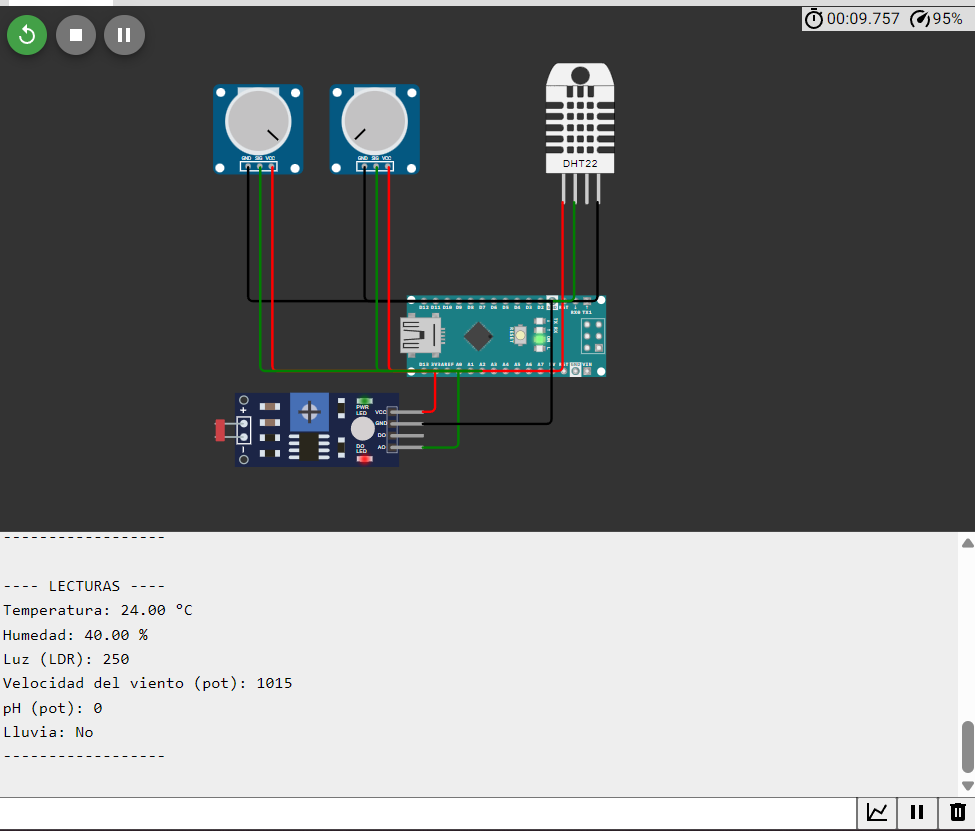

## Objetivo

Simular el comportamiento de sensores industriales utilizando componentes disponibles en Wokwi, con el fin de probar el flujo de datos en tiempo real hacia la API WebSocket de AgroSoft. Este montaje permite validar tanto el formato como la estructura esperada de los datos que se reciben en el backend.

---

## Equivalencia de Sensores

Debido a la falta de sensores industriales en el simulador Wokwi, se optó por utilizar sensores electrónicos básicos que permitan emular señales similares:

| Sensor Simulado  | Sensor Industrial Real      | Medición Representada           |
|------------------|-----------------------------|----------------------------------|
| DHT22            | Pt100 (RTD) + TEROS 12      | Temperatura y humedad del aire  |
| Potenciómetro A1 | RM Young 05103              | Velocidad del viento            |
| Potenciómetro A2 | Sensorex S272CD             | pH del suelo                    |
| LDR (con divisor de voltaje) | LI-COR LI-190R | Radiación solar / luminosidad   |
| Botón digital    | Davis 7852                  | Presencia de lluvia             |

---

### Conexiones del Montaje en Wokwi

El siguiente diagrama representa las conexiones realizadas en el simulador usando un Arduino Nano ESP32. A continuación, se detallan los pines y su función:
<br />
  

### 1. Sensor DHT22 (Temperatura y Humedad)
- **VCC** → 5V
- **GND** → GND
- **DATA** → Pin D2

### 2. Sensor de Luz (LDR)
- LDR conectado a un divisor de voltaje con una resistencia de 10kΩ
- Salida analógica del divisor → Pin A0

### 3. Potenciómetro 1 (Velocidad del viento)
- VCC (izq) → 5V  
- GND (der) → GND  
- Salida (centro) → Pin A1

### 4. Potenciómetro 2 (pH)
- VCC (izq) → 5V  
- GND (der) → GND  
- Salida (centro) → Pin A2

### 5. Botón (Lluvia)
- Un extremo a GND  
- Otro extremo a Pin D3 (con resistencia pull-up interna activada)

---

## Código para Simulación y Envío de Datos

El siguiente sketch en Arduino permite simular sensores y enviar sus datos en tiempo real por WebSocket, siguiendo el formato esperado por AgroSoft API:

```cpp
#include <WiFi.h>
#include <WebSocketsClient.h>
#include <DHT.h>

#define DHTPIN 2
#define DHTTYPE DHT22
DHT dht(DHTPIN, DHTTYPE);

// Pines de sensores
const int pinLuz = A0;
const int pinViento = A1;
const int pinPH = A2;
const int pinLluvia = 3;

// Configuración WiFi
const char* ssid = "TU_SSID";
const char* password = "TU_PASSWORD";

// Configuración WebSocket
const char* websocket_server = "TU_IP_BACKEND";
const uint16_t websocket_port = 8000;
const char* websocket_path = "/ws/sensor/TEM/"; // O puedes usar /ws/sensor/5/

WebSocketsClient webSocket;

void webSocketEvent(WStype_t type, uint8_t * payload, size_t length) {
  if (type == WStype_DISCONNECTED) {
    Serial.println("Desconectado del WebSocket");
  } else if (type == WStype_CONNECTED) {
    Serial.println("Conectado al WebSocket");
  } else if (type == WStype_TEXT) {
    Serial.printf("Mensaje recibido: %s\n", payload);
  }
}

void setup() {
  Serial.begin(115200);
  dht.begin();

  pinMode(pinLuz, INPUT);
  pinMode(pinViento, INPUT);
  pinMode(pinPH, INPUT);
  pinMode(pinLluvia, INPUT_PULLUP);

  WiFi.begin(ssid, password);
  while (WiFi.status() != WL_CONNECTED) {
    delay(500);
    Serial.print(".");
  }
  Serial.println("Conectado a WiFi");

  webSocket.begin(websocket_server, websocket_port, websocket_path);
  webSocket.onEvent(webSocketEvent);
  webSocket.setReconnectInterval(5000);
}

void loop() {
  webSocket.loop();

  float temp = dht.readTemperature();
  float hum = dht.readHumidity();
  int luz = analogRead(pinLuz);
  int viento = analogRead(pinViento);
  int ph = analogRead(pinPH);
  bool lluvia = digitalRead(pinLluvia) == LOW;

  String payload = "{";
  payload += "\"sensor\": \"TEM\",";
  payload += "\"valor\": " + String(temp, 2) + ",";
  payload += "\"fecha\": \"" + String(__DATE__) + "T" + String(__TIME__) + "Z\"";
  payload += "}";

  Serial.println(payload);
  webSocket.sendTXT(payload);

  delay(2000); // Espera 2 segundos entre mediciones
}
```

---

## Estructura del Mensaje WebSocket

Todos los datos se envían al servidor WebSocket en formato JSON con la siguiente estructura:

```json
{
  "sensor": "TEM",
  "valor": 24.7,
  "fecha": "2025-03-27T12:10:00Z"
}
```

- `"sensor"`: Código del tipo de sensor (`TEM`, `LUM`, `HUM_A`, `VIENTO`, `PH`, `LLUVIA`)
- `"valor"`: Valor numérico obtenido de la lectura
- `"fecha"`: Fecha y hora del envío en formato ISO 8601

---

## Conexión al WebSocket

Este simulador se conecta a la API usando alguno de los siguientes endpoints WebSocket:

### Endpoint por tipo de sensor
```ws
ws://127.0.0.1:8000/ws/sensor/TEM/
```
Permite enviar o recibir datos de **todos los sensores de tipo "TEM" (temperatura)**.

### Endpoint por sensor específico
```ws
ws://127.0.0.1:8000/ws/sensor/5/
```
Permite enviar datos de **un solo sensor identificado por ID**.

---

## Diferencias entre los Endpoints

| Endpoint WebSocket              | Descripción                                     |
|--------------------------------|-------------------------------------------------|
| `/ws/sensor/{sensor_name}/`    | Escucha/envía datos de todos los sensores de un tipo (ej: `TEM`) |
| `/ws/sensor/:id/`              | Escucha/envía datos de un sensor específico (por ID)             |

---

## Consideraciones Finales

- El ESP32 se conecta automáticamente al WebSocket al encenderse.
- Cada 2 segundos se envía un nuevo paquete de datos.
- Puedes modificar el campo `"sensor"` en el código según el tipo simulado (`TEM`, `HUM_A`, `LUM`, `PH`, etc.).
- Este simulador puede usarse para probar notificaciones en frontend, generación de alertas y gráficos en tiempo real.


