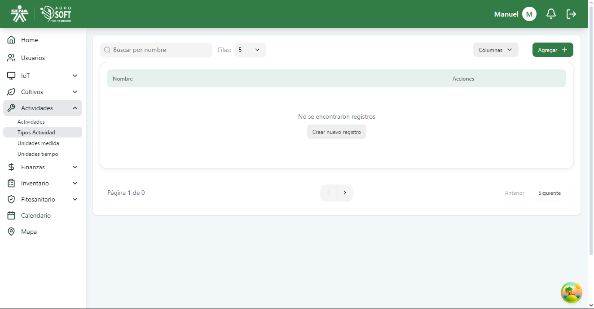
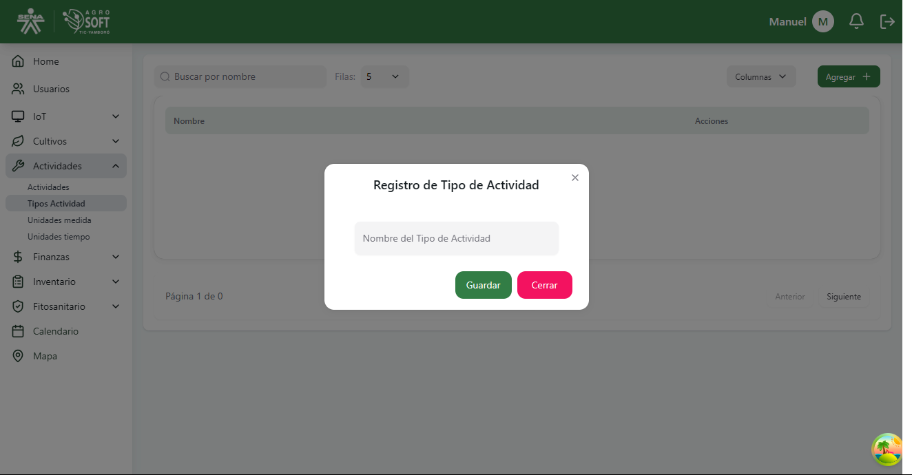
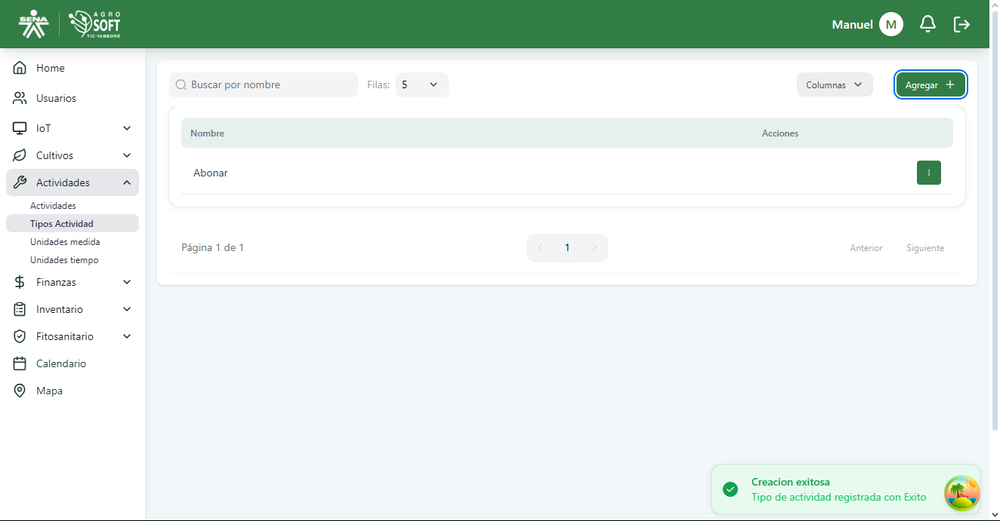
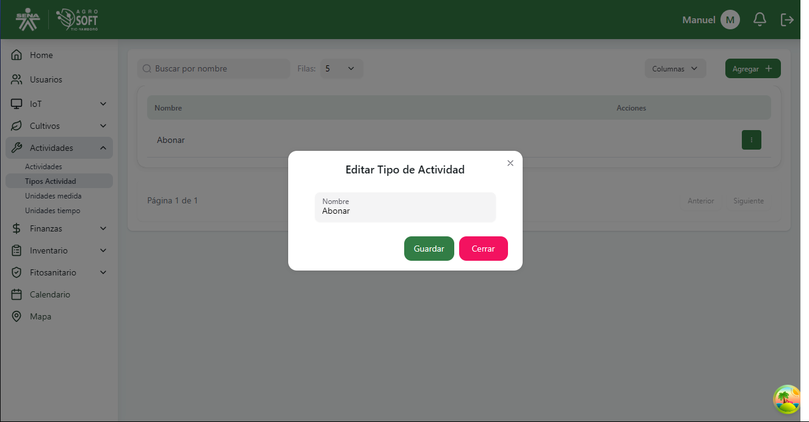

# Tipos de Actividad

El módulo **Tipos de Actividad** permite definir y clasificar las diferentes tareas agrícolas que se realizan en los cultivos, como riego, fertilización, control de plagas, entre otros.  
Estos tipos sirven como referencia al momento de registrar actividades específicas en cada cultivo.

## 1️ Acceder a la sección de Tipos de Actividad

Para gestionar los tipos de actividad, sigue estos pasos:

1. Inicia sesión en el sistema.
2. En el menú de navegación, selecciona **Actividades**.
3. Haz clic en la opción **Tipos Actividad**.

###  Página de tipos de actividad  

---

## 2️ Registrar un nuevo Tipo de Actividad

Para agregar un nuevo tipo de actividad:

1. Dentro de la pantalla de **Tipos Actividad**, haz clic en el botón **"Agregar"**.
2. Completa el campo correspondiente:

###  Agregar tipo de actividad  

- **Nombre:** Escribe el nombre que identificará al tipo de actividad (ej. "Fertilización", "Riego").

3. Haz clic en **"Guardar"** para registrar el nuevo tipo.

---

## 3️ Consultar y editar tipos de actividad existentes

- Para **ver los tipos registrados**, utiliza la lista mostrada en la sección.

###  Lista de tipos de actividad  

- Para **editar** un tipo de actividad:
  1. Haz clic en los tres puntos debajo de **Acciones**.
  2. Selecciona **Editar**.
  3. Modifica el nombre si es necesario.
  4. Haz clic en **Guardar**.

###  Ventana editar tipo  

