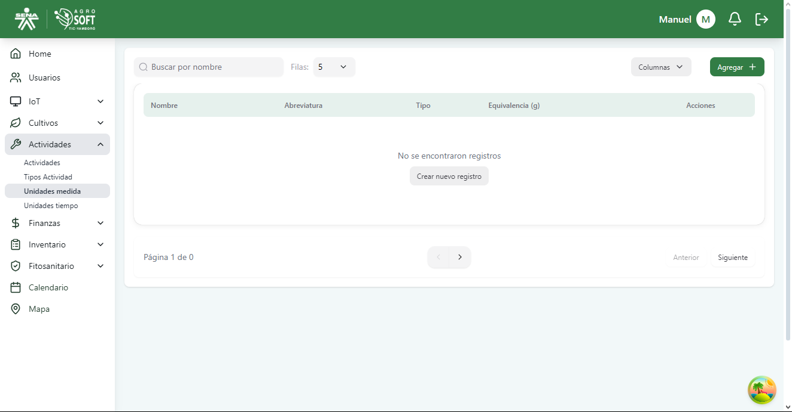
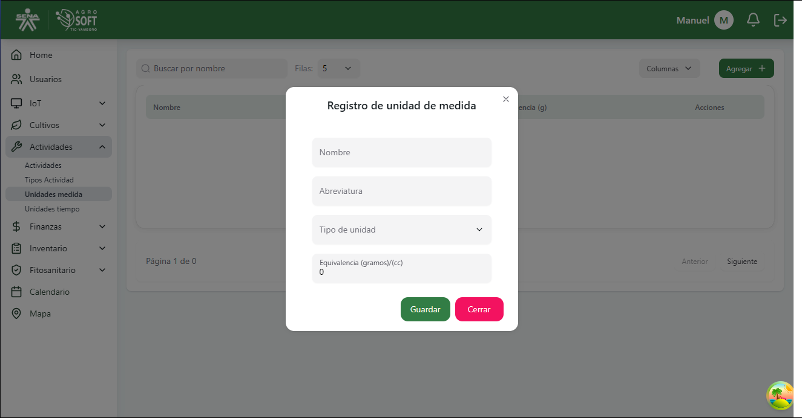
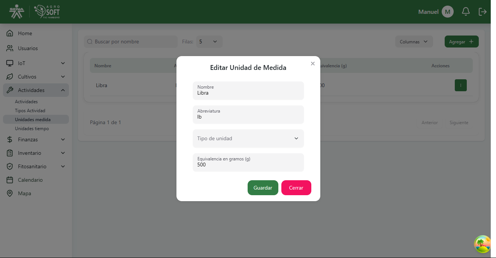

# Unidades de Medida

El módulo **Unidades de Medida** permite definir las distintas unidades empleadas para cuantificar insumos o labores en las actividades agrícolas, como kilogramos, litros, metros, entre otros.  
Estas unidades son necesarias al registrar actividades que requieren una cantidad medida (ej. aplicar 10 litros de fertilizante).

## 1️ Acceder a la sección de Unidades de Medida

Para gestionar las unidades, sigue estos pasos:

1. Inicia sesión en el sistema.
2. En el menú de navegación, selecciona **Actividades**.
3. Haz clic en la opción **Unidades medida**.

###  Página de unidades de medida  

---

## 2️ Registrar una nueva Unidad de Medida

Para agregar una nueva unidad de medida:

1. Dentro de la pantalla de **Unidades medida**, haz clic en el botón **"Agregar"**.
2. Completa el campo correspondiente:

###  Agregar unidad de medida  

- **Nombre:** Escribe el nombre de la unidad (ej. "Kilogramo", "Litro", "Metro").

3. Haz clic en **"Guardar"** para registrar la nueva unidad.

---

## 3️ Consultar y editar unidades existentes

- Para **ver las unidades registradas**, usa la lista que aparece en la sección.

###  Lista de unidades de medida  

- Para **editar** una unidad:
  1. Haz clic en los tres puntos debajo de **Acciones**.
  2. Selecciona **Editar**.
  3. Realiza los cambios necesarios.
  4. Haz clic en **Guardar**.

###  Ventana editar unidad  

