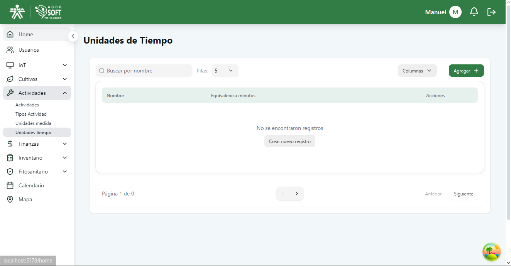
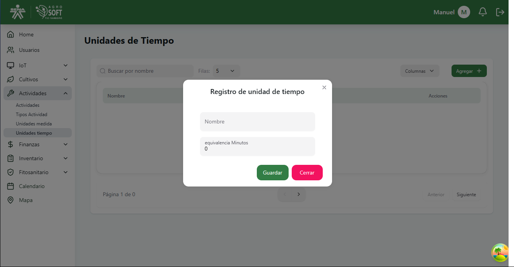
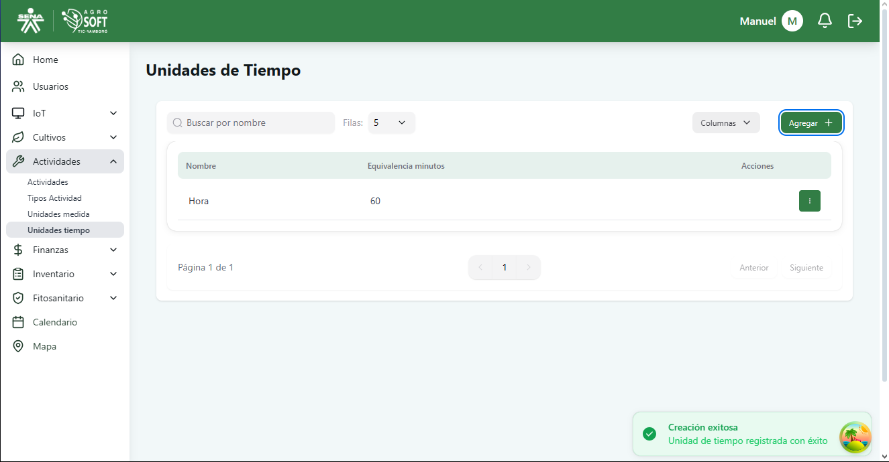
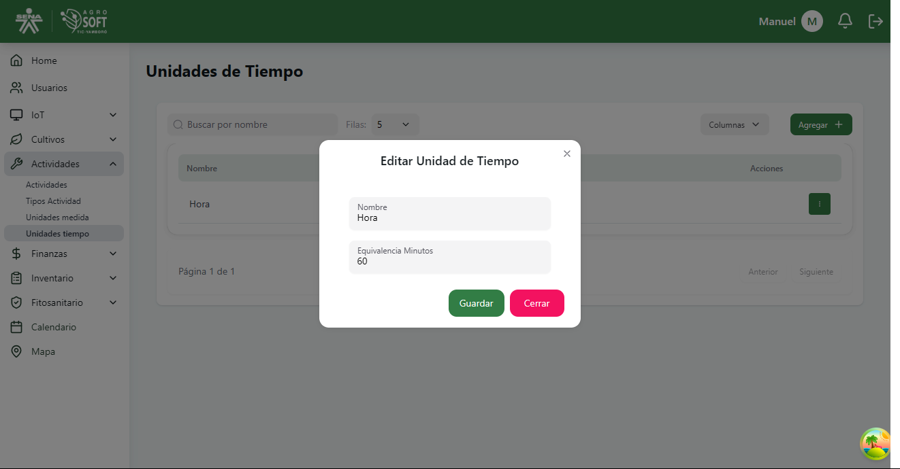

# Unidades de Tiempo

El módulo **Unidades de Tiempo** permite definir las diferentes unidades empleadas para medir la duración de las actividades agrícolas, como horas, días, semanas, entre otras.  
Estas unidades son necesarias al registrar actividades que requieren especificar un tiempo estimado o ejecutado.

## 1️ Acceder a la sección de Unidades de Tiempo

Para gestionar las unidades de tiempo, sigue estos pasos:

1. Inicia sesión en el sistema.
2. En el menú de navegación, selecciona **Actividades**.
3. Haz clic en la opción **Unidades tiempo**.

###  Página de unidades de tiempo  

---

## 2️ Registrar una nueva Unidad de Tiempo

Para agregar una nueva unidad de tiempo:

1. Dentro de la pantalla de **Unidades tiempo**, haz clic en el botón **"Agregar"**.
2. Completa el campo correspondiente:

###  Agregar unidad de tiempo  

- **Nombre:** Escribe el nombre de la unidad (ej. "Hora", "Día", "Semana").

3. Haz clic en **"Guardar"** para registrar la nueva unidad.

---

## 3️ Consultar y editar unidades existentes

- Para **ver las unidades registradas**, usa la lista que aparece en la sección.

###  Lista de unidades de tiempo  

- Para **editar** una unidad:
  1. Haz clic en los tres puntos debajo de **Acciones**.
  2. Selecciona **Editar**.
  3. Realiza los cambios necesarios.
  4. Haz clic en **Guardar**.

###  Ventana editar unidad  

