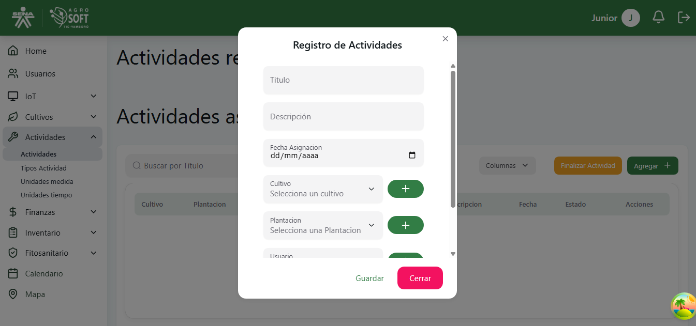

#  Uso de Actividades

El módulo **Actividades** permite registrar, gestionar y dar seguimiento a las labores agrícolas realizadas en los cultivos. Estas actividades pueden incluir riego, fertilización, control de plagas, entre otras.  
Antes de crear una actividad, debe existir al menos un **cultivo** y un **usuario** registrado en el sistema.

## 1️ Acceder a la sección de Actividades

Para gestionar las actividades, sigue estos pasos:

1. Inicia sesión en el sistema.
2. En el menú de navegación, selecciona **Seguimiento de Cultivos**.
3. Dentro de esta sección, haz clic en **Actividades**.

###  Página de actividades  
  

---

## 2️ Registrar una nueva Actividad

Para agregar una nueva actividad:

1. Asegúrate de que existe al menos un **cultivo** registrado en el sistema.
2. Dentro de la pantalla de **Actividades**, haz clic en el botón **"Agregar"**.
3. Completa los siguientes campos:

###  Agregar actividad  

- **Nombre:** Escribe un nombre para la actividad.
- **Cultivo asociado:** Selecciona el cultivo al cual se relaciona la actividad.
- **Descripción:** Breve detalle de la actividad.
- **Fecha:** Fecha en la que se realizará la actividad.
- **Tipo:** Selecciona el tipo de actividad (riego, fertilización, etc.).

4. Haz clic en **"Guardar"** para registrar la actividad.

---

## 3️ Consultar y editar actividades existentes

- Para **ver la información** de una actividad, usa la lista disponible en la sección.

###  Lista de actividades  

- Para **editar** una actividad:
  1. Haz clic en los tres puntos debajo de **Acciones**.
  2. Selecciona **Editar**.
  3. Modifica los datos necesarios.
  4. Haz clic en **Guardar**.

###  Ventana editar  

