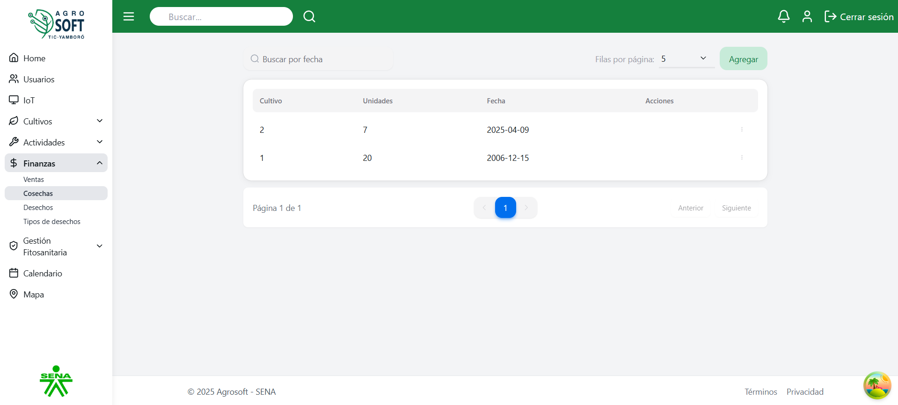
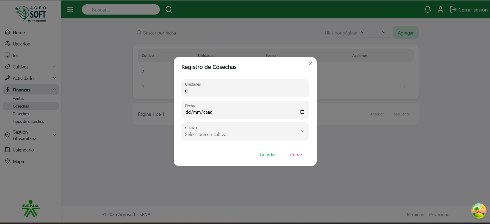
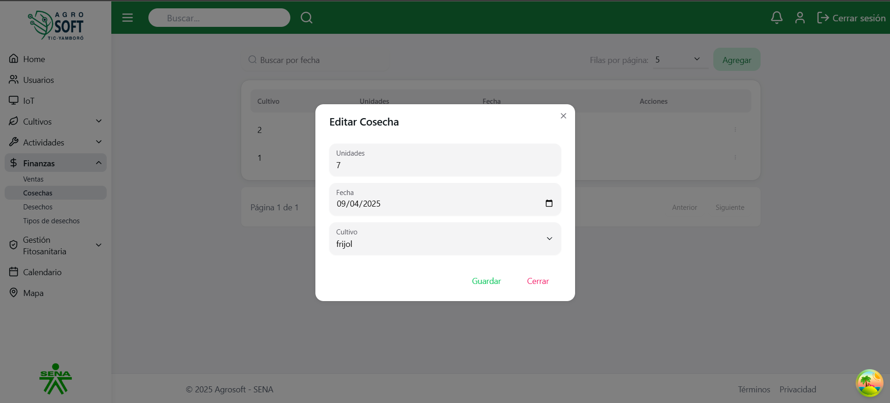

# 🌾 Uso de Cosechas

El módulo **Cosechas** permite registrar y administrar la producción obtenida de los cultivos. Ayuda a llevar un control detallado de cada recolección realizada, facilitando el análisis de rendimiento y productividad del cultivo.Antes de crear una cosecha, debe existir al menos un **cultivo** registrado en el sistema.

---

## 1️⃣ Acceder a la sección de Cosechas

Para gestionar las cosechas, sigue estos pasos:

1. Inicia sesión en el sistema.
2. En el menú de navegación, selecciona **Seguimiento de Cultivos**.
3. Dentro de esta sección, haz clic en **Cosechas**.

### 📸 Página de cosechas  

---

## 2️⃣ Registrar una nueva Cosecha

Para agregar una nueva cosecha:

1. Asegúrate de que existe al menos un cultivo registrado en el sistema.
2. Dentro de la pantalla de **Cosechas**, haz clic en el botón **"Agregar"**.
3. Completa los siguientes campos:

### 📸 Agregar cosecha  

- **Cultivo asociado:** Selecciona el cultivo del cual se realiza la cosecha.
- **Cantidad cosechada:** Indica la cantidad total recolectada.
- **Unidad de medida:** Especifica la unidad (kg, ton, etc.).
- **Fecha de cosecha:** Selecciona la fecha en que se realizó la recolección.
- **Observaciones:** Agrega comentarios relevantes (opcional).

4. Haz clic en **"Guardar"** para registrar la cosecha.

---

## 3️⃣ Consultar y editar cosechas existentes

- Para **ver** la información de una cosecha, consulta la lista disponible en la sección.

### 📸 Lista de cosechas  
*Captura de pantalla*

- Para **editar** una cosecha:
  1. Haz clic en los tres puntos debajo de **Acciones**.
  2. Selecciona **Editar**.
  3. Modifica los datos necesarios.
  4. Haz clic en **Guardar**.

### 📸 Ventana editar  

