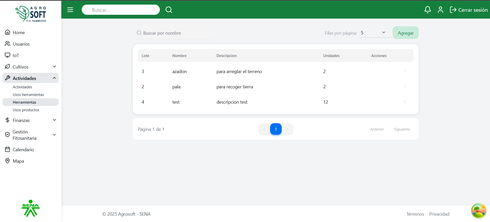
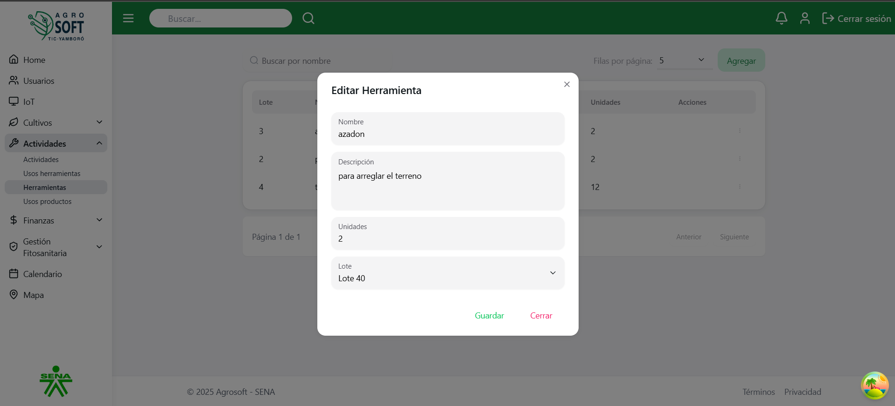
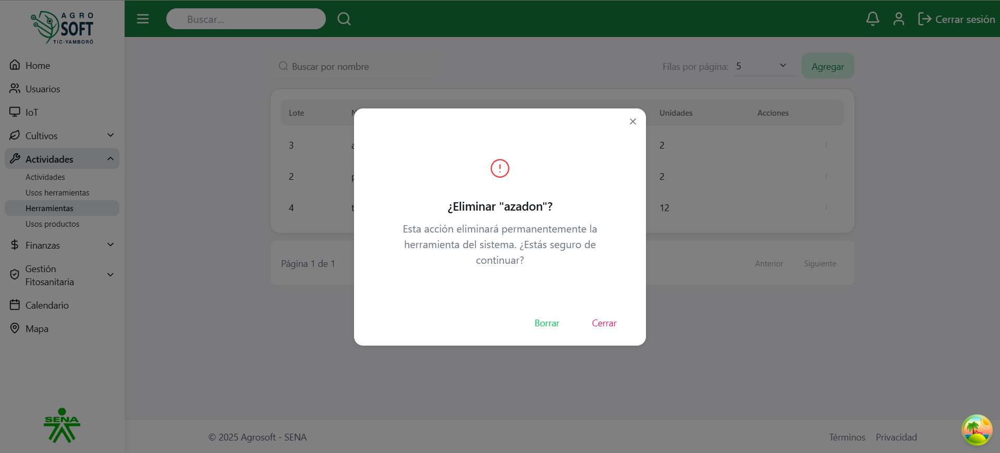

# 🔧 Uso de Herramientas

El módulo **Herramientas** permite registrar y gestionar todas las herramientas agrícolas disponibles en el sistema. Facilita el control del inventario de herramientas utilizadas en las actividades de producción, garantizando una mejor trazabilidad y uso eficiente del equipo.Antes de crear una herramienta, debe existir al menos un **lote** registrado en el sistema.

---

## 1️⃣ Acceder a la sección de Herramientas

Para gestionar las herramientas, sigue estos pasos:

1. Inicia sesión en el sistema.
2. En el menú de navegación, selecciona **Seguimiento de Cultivos**.
3. Dentro de esta sección, haz clic en **Herramientas**.

### 📸 Página de herramientas  
 

---

## 2️⃣ Registrar una nueva Herramienta

Para agregar una herramienta:

1. Dentro de la pantalla de **Herramientas**, haz clic en el botón **"Agregar"**.
2. Completa los siguientes campos:

### 📸 Agregar herramienta  
*Captura de pantalla agregar herramienta*

- **Nombre:** Escribe el nombre de la herramienta.
- **Descripción:** Describe brevemente el uso o características de la herramienta.
- **Cantidad disponible:** Indica cuántas unidades hay disponibles.
- **Estado:** Selecciona si está activa o inactiva.

3. Haz clic en **"Guardar"** para registrar la herramienta.

---

## 3️⃣ Consultar, editar y eliminar herramientas existentes

- Para **ver** la información de una herramienta, consulta la lista disponible en la sección.

### 📸 Lista de herramientas  
 

- Para **editar** una herramienta:
  1. Haz clic en los tres puntos debajo de **Acciones**.
  2. Selecciona **Editar**.
  3. Modifica los datos necesarios.
  4. Haz clic en **Guardar**.

### 📸 Ventana editar  
 

- Para **eliminar** una herramienta:
  1. Haz clic en los tres puntos debajo de **Acciones**.
  2. Selecciona **Eliminar**.
  3. Confirma la acción.

Si no deseas eliminar la herramienta, haz clic en **Cerrar**.

### 📸 Ventana eliminar  
 

