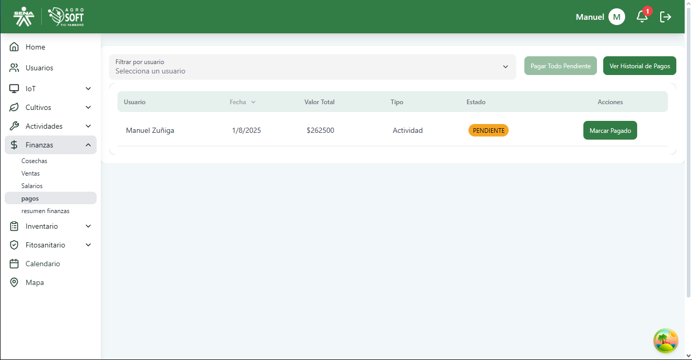
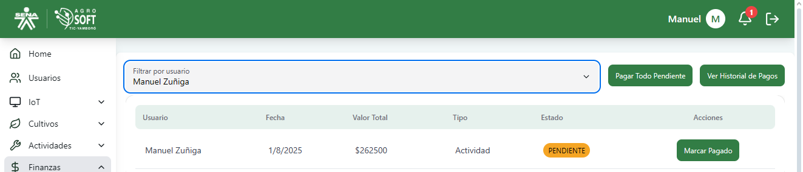
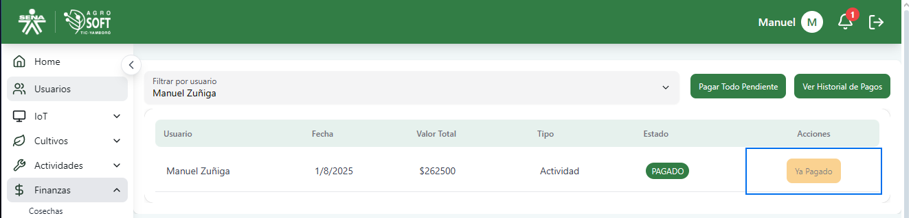
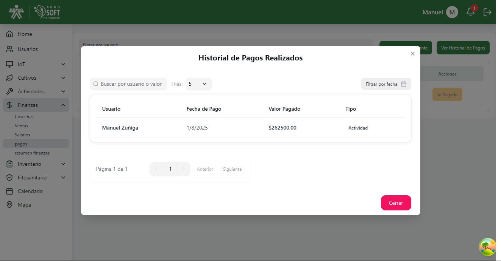

# Uso del módulo de Pagos

El módulo **Pagos** permite llevar un control de los pagos generados por actividades realizadas en el sistema.  
A través de esta funcionalidad, puedes revisar los pagos pendientes, efectuar pagos individuales o en lote, y consultar el historial de transacciones por usuario.

## 1️ Acceder a la sección de Pagos

Para gestionar los pagos, sigue estos pasos:

1. Inicia sesión en el sistema.
2. En el menú de navegación, haz clic en **Finanzas**.
3. Selecciona la opción **Pagos**.

### Página de pagos  

---

## 2️ Filtrar y realizar pagos

Dentro de esta pantalla, puedes:

- **Filtrar por usuario:** Selecciona un usuario para visualizar los pagos relacionados.
- **Ver historial de pagos:** Consulta todos los pagos ya procesados.
- **Pagar Todo Pendiente:** Realiza el pago total de las actividades pendientes del usuario seleccionado.

---

## 3️ Visualizar tabla de pagos

La tabla muestra información relevante como:

- **Usuario:** Persona a la que corresponde el pago.
- **Fecha:** Fecha en que se generó el pago.
- **Valor Total:** Monto total correspondiente.
- **Tipo:** Categoría del pago (por ejemplo, actividad).
- **Estado:** Indica si el pago está pendiente o ya fue procesado.
- **Acciones:** Permite realizar el pago manualmente o ver más detalles.

Cuando no hay registros, la tabla mostrará el mensaje “No hay registros”.

---

## 4️ Realizar un pago manual

Para realizar un pago individual:

1. Filtra por el usuario correspondiente.
2. En la tabla de registros, haz clic en el botón de acción correspondiente.
3. Selecciona la opción **Pagar**.
4. Confirma el pago desde la ventana emergente.

---

## 5️ Consultar historial de pagos

1. Haz clic en el botón verde **Ver Historial de Pagos**.
2. Se mostrará una vista con los pagos realizados anteriormente, organizados por fecha y usuario.

