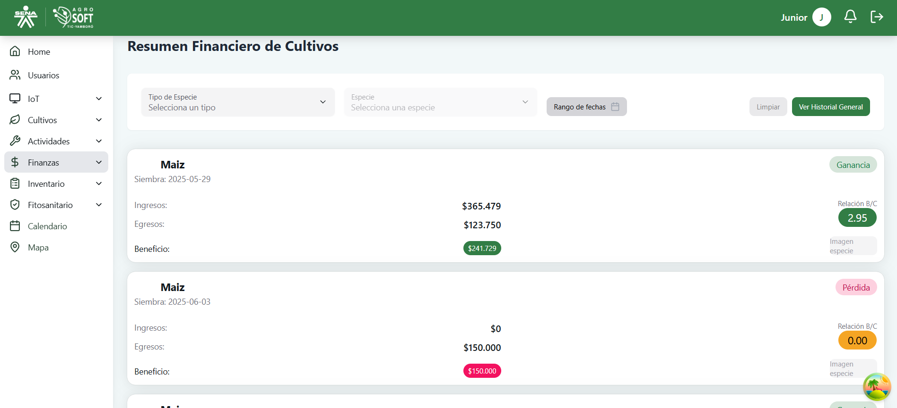
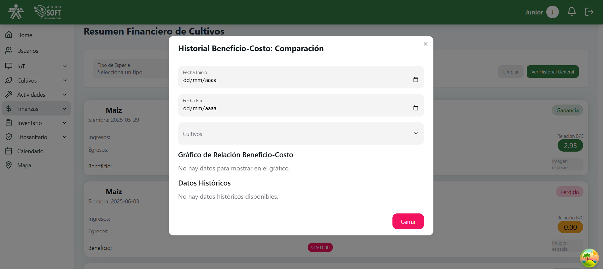

El módulo **Resumen Financiero** permite visualizar los ingresos y egresos asociados a un cultivo, brindando una trazabilidad clara y completa del rendimiento económico sin modificar registros.

## Vista General

Se presentan tarjetas con indicadores clave:

- **Ingresos Totales**
- **Egresos Totales**
- **Balance Final**
- **Rentabilidad (%)**

## Tabla de historial general
Lista los registros financieros relacionados al cultivo seleccionado:

- **Fecha**
- **Tipo de Movimiento**
- **Descripción**
- **Valor**
- **Categoría** (Ej: venta, insumos, mano de obra)

>Solo se permite búsqueda y visualización, no edición ni eliminación.

## Visualización Gráfica

Gráficos dinámicos que permiten interpretar fácilmente los datos:

- **Ingreso vs Egreso por mes**
- **Distribución de egresos por categoría**
- **Evolución del balance**

