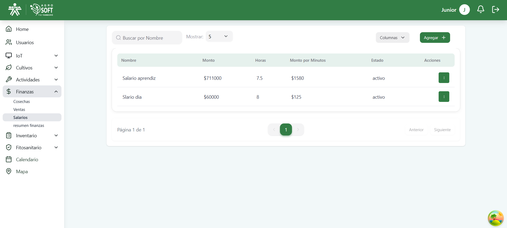
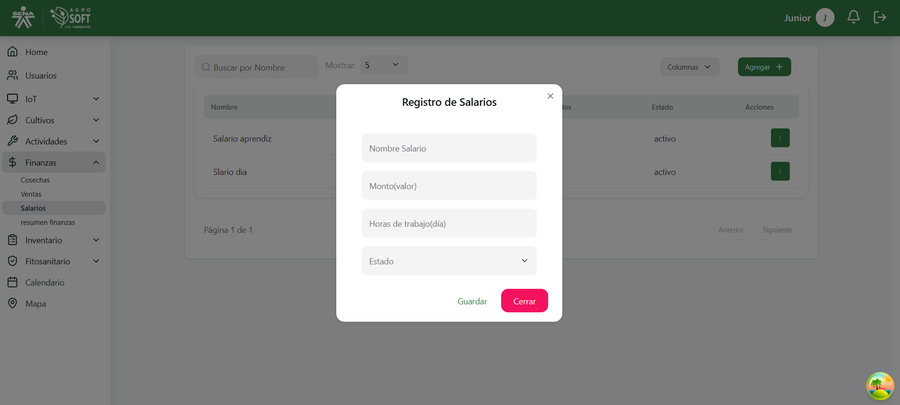
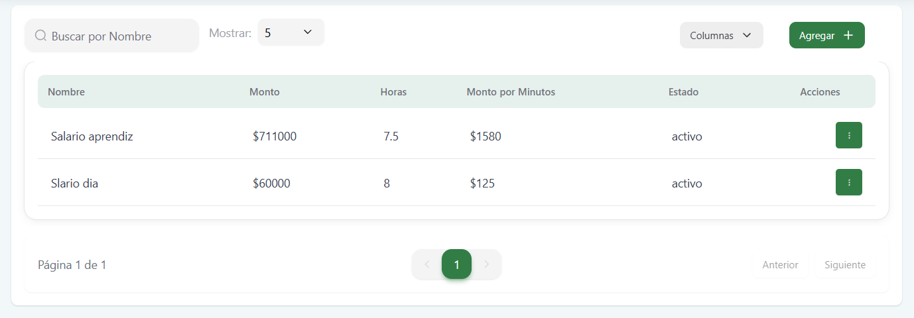
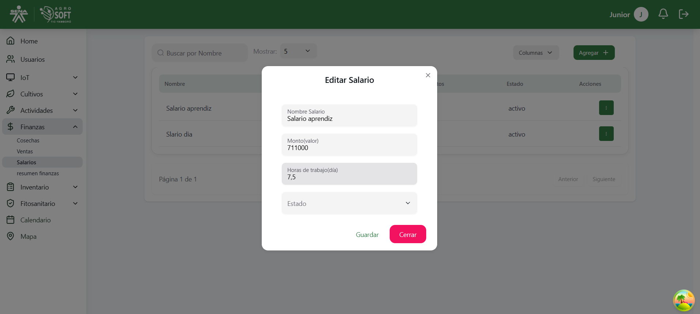

Este módulo permite registrar y gestionar los salarios asignados a cada usuario del sistema, útiles para el cálculo de costos por actividades o controles.

## Vista Principal

Se muestran tarjetas o una tabla con la siguiente información:

- **Nombre del Usuario**
- **Monto por Hora**
- **Horas Laboradas**
- **Monto por Minuto**
- **Estado** (Activo/Inactivo)

## Agregar Salario

Desde el botón "**Agregar**", se permite registrar un nuevo salario con los siguientes campos:

- **Nombre del Usuario**
- **Monto**
- **Horas de trabajo**
- **Estado**

Botones disponibles: **Guardar**, **Cerrar**

## Tabla de Registros

- **Nombre**
- **Monto**
- **Horas**
- **Monto Minuto**
- **Estado**
- **Acciones** (Editar / Eliminar)

## Editar Salario

Formulario para actualizar los datos del salario del usuario.

