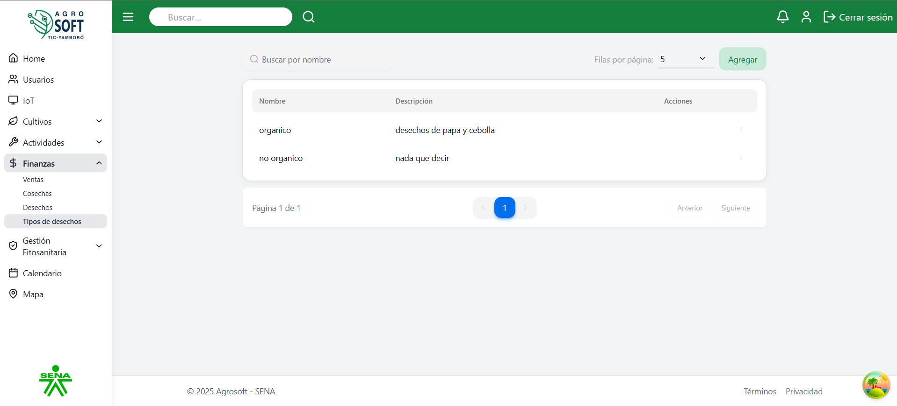
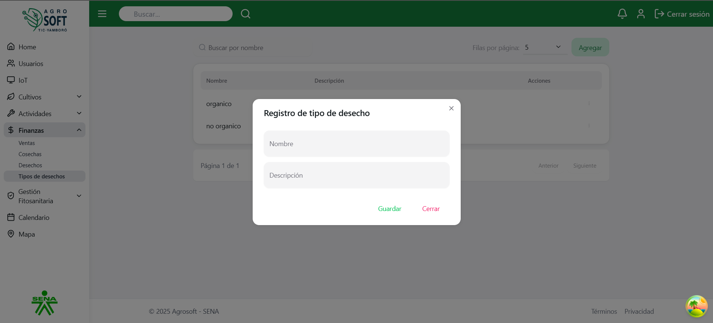
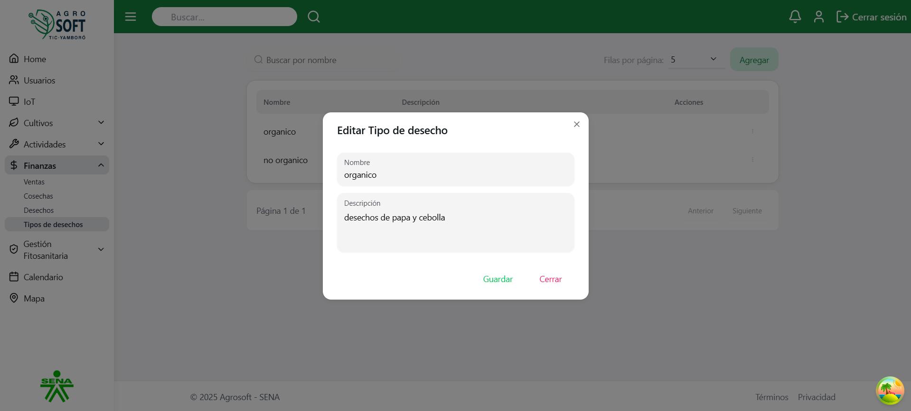

# 🧪 Uso de Tipos de Desechos

El módulo **Tipos de Desechos** permite clasificar los distintos residuos generados durante los procesos agrícolas. Facilita una mejor gestión ambiental y permite un control más detallado de los desechos según su origen, tipo y tratamiento requerido.

---

## 1️⃣ Acceder a la sección de Tipos de Desechos

Para gestionar los tipos de desechos, sigue estos pasos:

1. Inicia sesión en el sistema.
2. En el menú de navegación, selecciona **Seguimiento de Cultivos**.
3. Dentro de esta sección, haz clic en **Tipos de Desechos**.

### 📸 Página de Tipos de Desechos  
 

---

## 2️⃣ Registrar un nuevo Tipo de Desecho

Para agregar un nuevo tipo de desecho:

1. Dentro de la pantalla de **Tipos de Desechos**, haz clic en el botón **"Agregar"**.
2. Completa los siguientes campos:

### 📸 Agregar tipo de desecho  
 

- **Nombre del tipo:** Escribe un nombre representativo del tipo de desecho.
- **Descripción:** Describe las características del desecho (orgánico, químico, etc.).
- **Categoría:** Si aplica, selecciona una categoría de clasificación (opcional).

3. Haz clic en **"Guardar"** para registrar el nuevo tipo de desecho.

---

## 3️⃣ Consultar y editar tipos de desechos existentes

- Para **ver** los tipos registrados, utiliza la lista disponible en la sección.

### 📸 Lista de tipos de desechos  
 

- Para **editar** un tipo de desecho:
  1. Haz clic en los tres puntos debajo de **Acciones**.
  2. Selecciona **Editar**.
  3. Modifica los campos necesarios.
  4. Haz clic en **Guardar**.

### 📸 Ventana editar  
 

