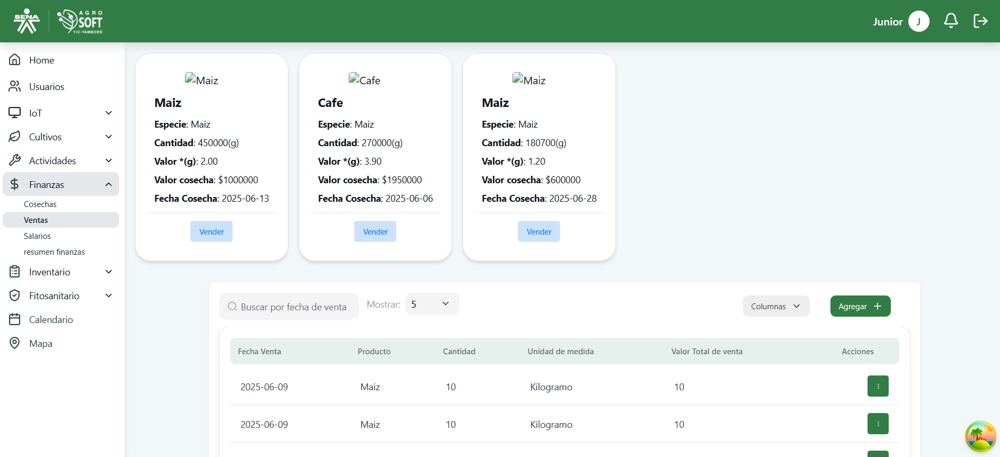
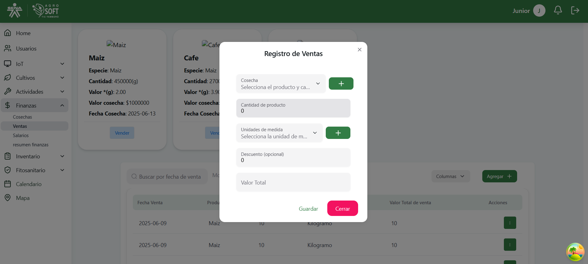
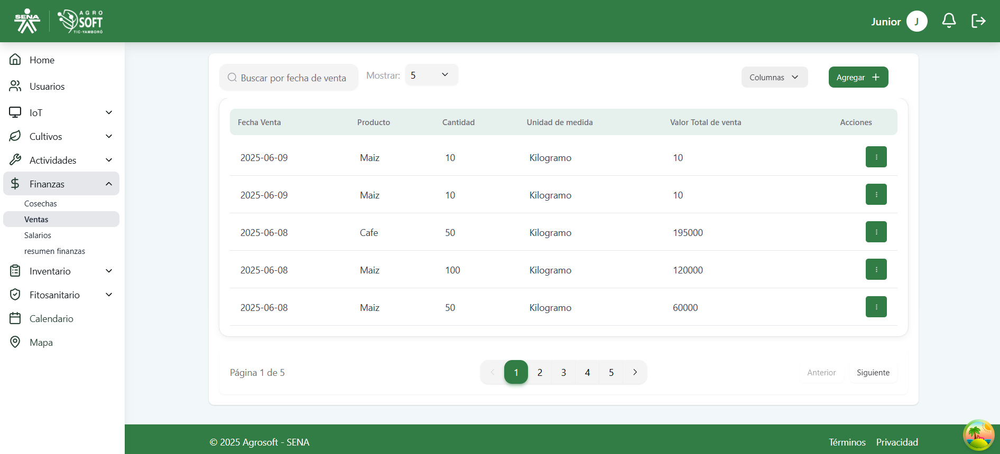
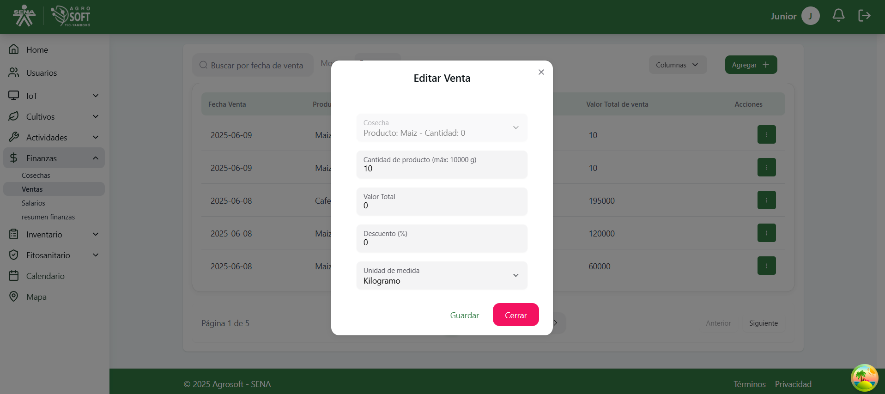

#  Uso de Ventas

El módulo **Ventas** permite registrar las transacciones comerciales relacionadas con los productos obtenidos de las cosechas. Facilita el seguimiento de ingresos, compradores y cantidades vendidas, ayudando a mantener un control financiero eficiente del sistema.Antes de registrar una cosecha debe existir al menos una **cosecha** en el sistema.

---

## 1️ Acceder a la sección de Ventas

Para gestionar las ventas, sigue estos pasos:

1. Inicia sesión en el sistema.
2. En el menú de navegación, selecciona **Seguimiento de Cultivos**.
3. Dentro de esta sección, haz clic en **Ventas**.

###  Página de ventas  

---

## 2️ Registrar una nueva Venta

Para agregar una nueva venta:

1. Asegúrate de que existe al menos una **cosecha registrada** en el sistema.
2. Dentro de la pantalla de **Ventas**, haz clic en el botón **"Agregar"**.
3. Completa los siguientes campos:

###  Agregar venta  
 

- **Producto vendido:** Selecciona el producto (cosecha) vendido.
- **Cantidad:** Ingresa la cantidad vendida.
- **Precio unitario:** Indica el precio por unidad.
- **Total:** Se calcula automáticamente (cantidad × precio unitario).
- **Comprador:** Ingresa el nombre del comprador.
- **Fecha de venta:** Selecciona la fecha de la transacción.
- **Observaciones:** Agrega notas o detalles (opcional).

4. Haz clic en **"Guardar"** para registrar la venta.

---

## 3️ Consultar y editar ventas existentes

- Para **ver** la información de una venta, consulta la lista disponible en la sección.

###  Lista de ventas  

- Para **editar** una venta:
  1. Haz clic en los tres puntos debajo de **Acciones**.
  2. Selecciona **Editar**.
  3. Modifica los datos necesarios.
  4. Haz clic en **Guardar**.

###  Ventana editar  
 
