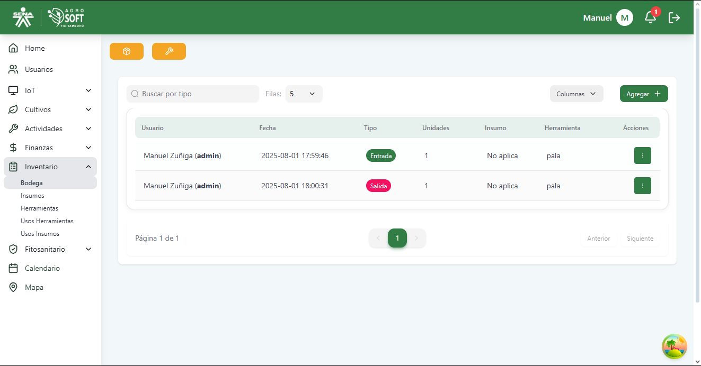
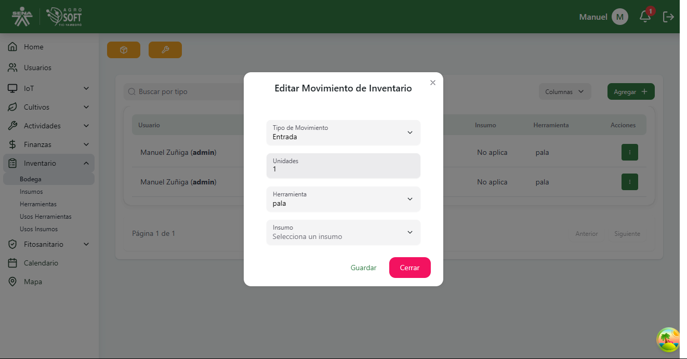

##  Uso del módulo Bodega

El módulo **Bodega** permite gestionar el almacenamiento de herramientas e insumos utilizados en el sistema. Antes de registrar herramientas o insumos, es necesario contar con al menos una bodega registrada.

### 1️ **Acceder a la sección de Bodega**
Para gestionar las bodegas, sigue estos pasos:
1. Inicia sesión en el sistema.
2. En el menú lateral, selecciona **Inventario**.
3. Haz clic en **Bodega** para acceder al módulo.

## Página principal de Bodega

### 2 **Consultar y editar movimiento del inventario**
- Para ver el mvimiento del inventario, consulta la lista principal disponible en la sección de Bodega.

## Lista de movimientos del inventario

- Para **editar** un movimiento, haz clic en los tres puntos en la columna de acciones, ajusta los datos necesarios y haz clic en **"Guardar"**.

## Editar movimientos del inventario

