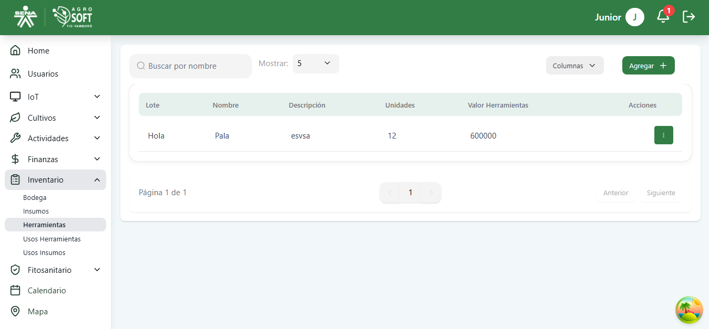
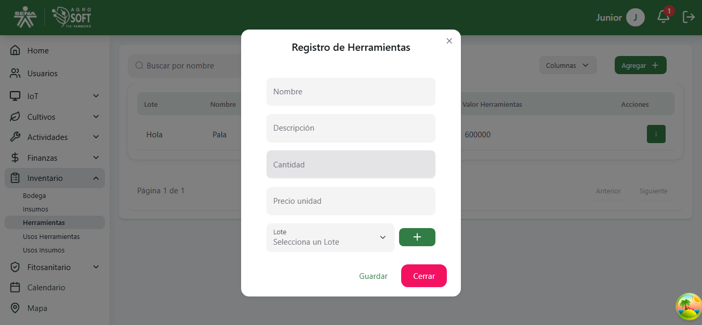
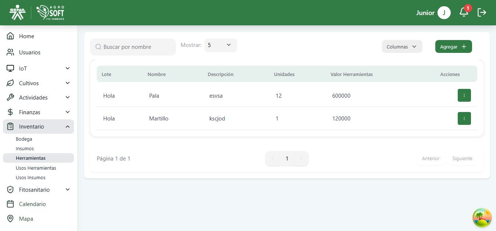
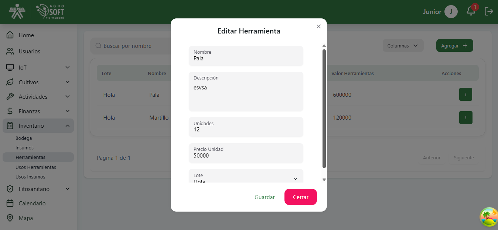

## 🛠️ Gestión de Herramientas

La sección **Herramientas** permite registrar y controlar los equipos y herramientas utilizados en las actividades agrícolas del sistema AgroSoft.

### 1️⃣ **Acceder a la sección de Herramientas**
Para gestionar las herramientas, sigue estos pasos:
1. Inicia sesión en el sistema.
2. Desde el menú lateral, selecciona **Inventario**.
3. Haz clic en **Herramientas**.

## Página de Herramientas

### 2️⃣ **Registrar una nueva Herramienta**
Para agregar una nueva herramienta:
1. En la pantalla de **Herramientas**, haz clic en el botón **"Agregar"**.
2. Completa los siguientes campos:

## Formulario agregar herramienta

   - **Nombre:** Nombre de la herramienta.
   - **Descripción**
   - **Cantidad:** Número de unidades disponibles.
   - **Precio unidad** 

3. Haz clic en **"Guardar"** para registrar la herramienta.

### 3️⃣ **Consultar y editar herramientas existentes**
- En la lista principal puedes visualizar todas las herramientas registradas.

## Lista de Herramientas

- Para editar una herramienta, haz clic en los tres puntos de **Acciones**, modifica los datos necesarios y selecciona **Guardar**.

## Editar Herramienta

