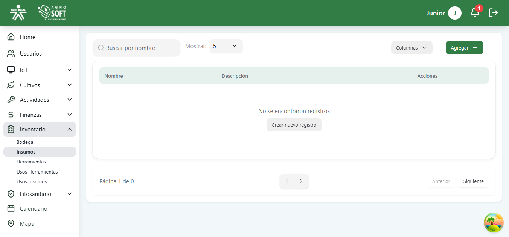
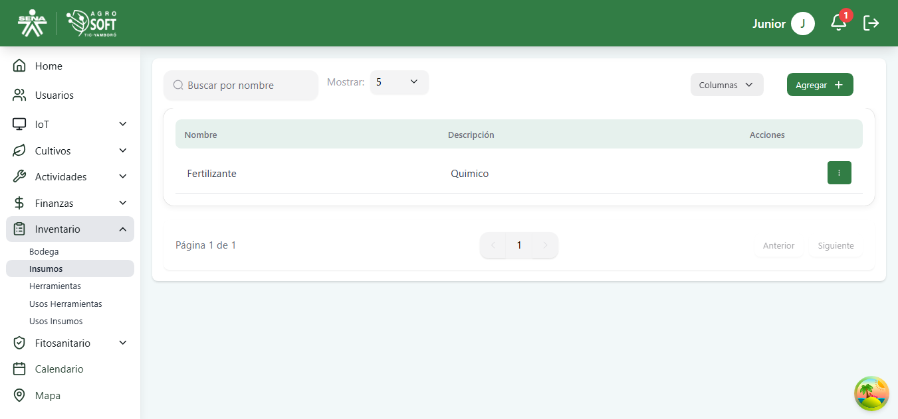
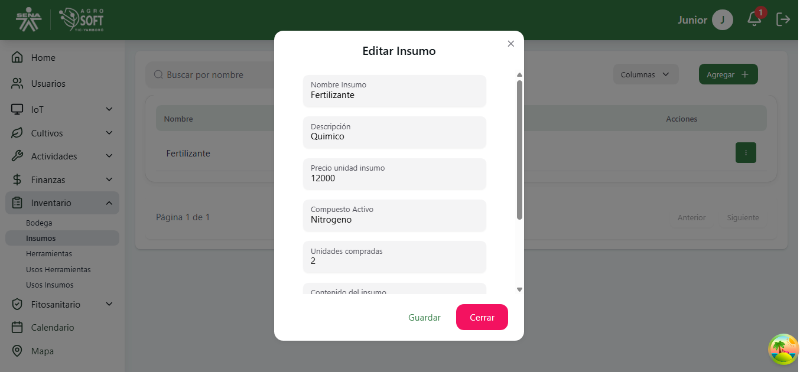

##  Gestión de Insumos

La sección **Insumos** permite registrar, consultar y administrar todos los insumos disponibles en el inventario agrícola, como fertilizantes, pesticidas o abonos.

### 1️ **Acceder a la sección de Insumos**
Para gestionar los insumos, sigue estos pasos:
1. Inicia sesión en el sistema.
2. Desde el menú lateral, selecciona **Inventario**.
3. Haz clic en **Insumos**.

## Página de Insumos

### 2️ **Registrar un nuevo Insumo**
Para agregar un insumo nuevo:
1. En la pantalla de **Insumos**, haz clic en el botón **"Agregar"**.
2. Completa los siguientes campos:

## Formulario agregar insumo

   - **Nombre:** Nombre del insumo.
   - **Descripción:** Breve detalle del producto.
   - **Precio unidad insumo**
   - **Compuesto activo:** Clasificación (abono, pesticida, etc.).
   - **Unidaes compradas** 
   - **Contenido del insumo**

3. Haz clic en **"Guardar"** para registrar el insumo.

### 3️ **Consultar y editar insumos existentes**
- En la lista principal puedes visualizar todos los insumos registrados.

## Lista de Insumos

- Para editar un insumo, haz clic en los tres puntos de **Acciones**, modifica los datos y selecciona **Guardar**.

## Editar insumo

