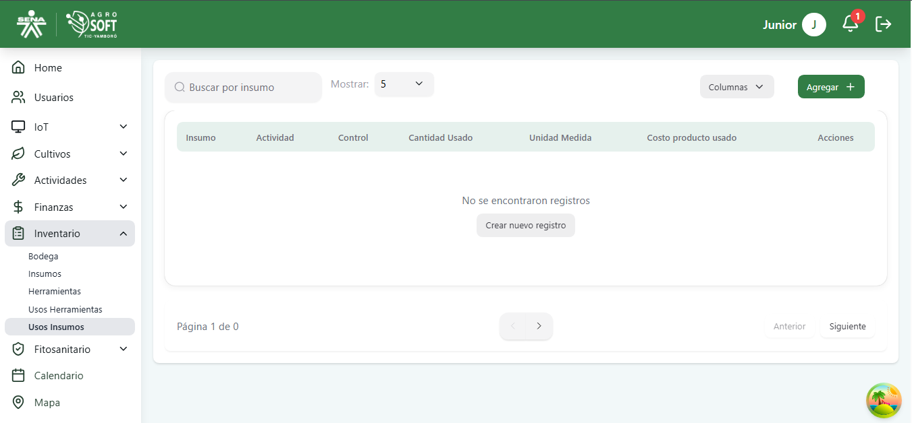
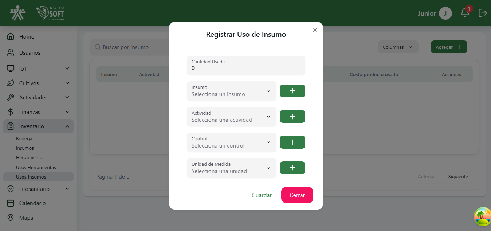
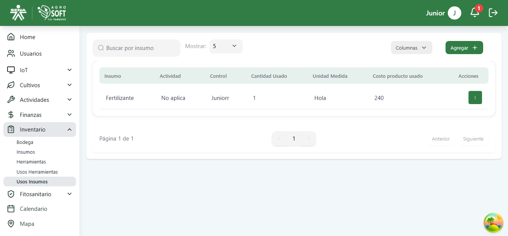
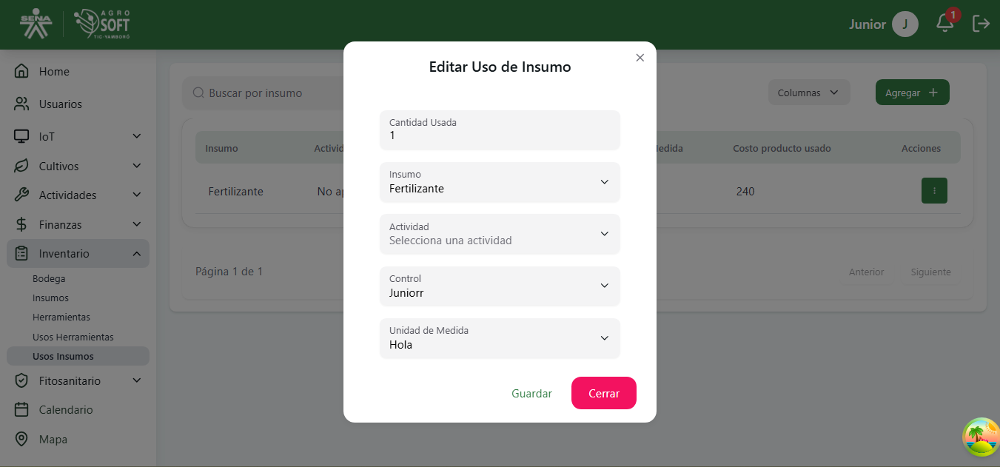

## 🧪 Gestión de Uso de Insumos

La sección **Uso de Insumos** permite registrar de manera precisa qué insumos fueron utilizados en una actividad determinada, ayudando al control de inventario y trazabilidad de cultivos.

### 1️⃣ **Acceder a la sección Uso de Insumos**
Sigue estos pasos para acceder:
1. Inicia sesión en el sistema.
2. Desde el menú lateral, selecciona **Inventario**.
3. Haz clic en **Uso de Insumos**.

## Página de Uso de Insumos

### 2️⃣ **Registrar un nuevo uso de insumo**
Para añadir un nuevo registro de uso:
1. En la pantalla de **Uso de Insumos**, haz clic en **"Agregar"**.
2. Completa los siguientes campos:

## Formulario agregar uso de insumos

   - **Cantidad usada:** Selecciona la cantidad a usar.
   - **Insumo:** Elige el insumo que fue utilizado.
   - **Actividad:** Selecciona la actividad a la que se asigna el insumo.
   - **Control:** Selecciona el control.
   - **Unidad medida:** Selecciona la unidad de medida.

3. Haz clic en **"Guardar"** para finalizar el registro.

### 3️⃣ **Consultar y editar usos registrados**
- Todos los usos registrados pueden visualizarse en la tabla principal de la sección.

## Tabla de usos registrados

- Para editar un registro, haz clic en los tres puntos debajo de la columna **Acciones** y selecciona **Editar**.

## Editar uso de insumo

