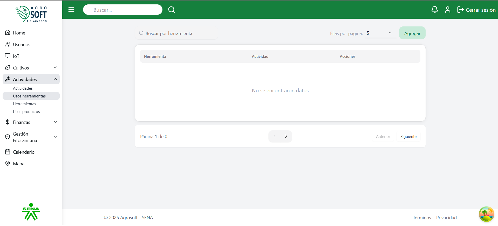
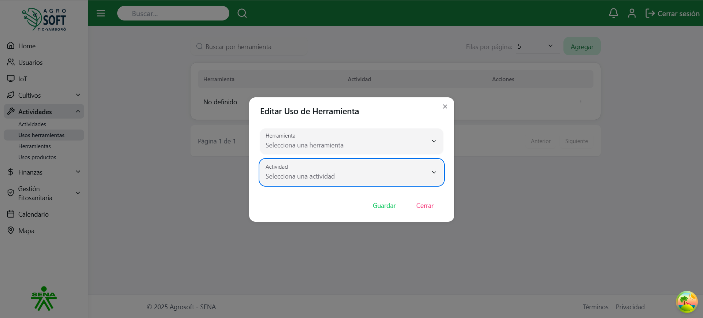

#  Uso de Usos de Herramientas

El módulo **Usos de Herramientas** permite registrar y gestionar el uso de herramientas en las actividades agrícolas del sistema. Esto facilita la trazabilidad del equipamiento utilizado y su asignación por actividad.

Antes de crear un uso de herramienta, debe existir al menos una **herramienta** y una **actividad** registrada en el sistema.

---

## 1️ Acceder a la sección de Usos de Herramientas

Para gestionar los usos de herramientas, sigue estos pasos:

1. Inicia sesión en el sistema.
2. En el menú de navegación, selecciona **Seguimiento de Cultivos**.
3. Dentro de esta sección, haz clic en **Usos de Herramientas**.

###  Página de usos de herramientas  
 

---

## 2️ Registrar un nuevo Uso de Herramienta

Para agregar un nuevo uso:

1. Asegúrate de que existe al menos una **herramienta** y una **actividad** registrada.
2. Dentro de la pantalla de **Usos de Herramientas**, haz clic en el botón **"Agregar"**.
3. Completa los siguientes campos:

###  Agregar uso de herramienta  
*Captura de pantalla agregar uso herramienta*

- **Herramienta:** Selecciona la herramienta que se usará.
- **Actividad:** Selecciona la actividad donde se usará la herramienta.
- **Cantidad:** Indica la cantidad de veces o unidades utilizadas.
- **Fecha:** Fecha del uso.

4. Haz clic en **"Guardar"** para registrar el uso.

---

## 3️ Consultar y eliminar usos existentes

- Para **ver la información** de un uso de herramienta, usa la lista disponible en la sección.

###  Lista de usos de herramientas  
*Captura de pantalla*

- Para **editar** un uso:
  1. Haz clic en los tres puntos debajo de **Acciones**.
  2. Selecciona **Editar**.
  3. Modifica los datos necesarios.
  4. Haz clic en **Guardar**.

###  Ventana editar  
 

