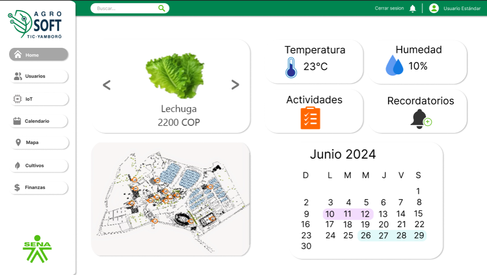

**La página de inicio de AgroSoft TIC-Yamboró es el punto central de acceso a la información y funciones del sistema. Desde esta pantalla, el usuario puede visualizar datos ambientales, gestionar actividades y navegar a diferentes secciones.**

## Pagina Principal  
  

## **Elementos de la Página**

### **1. Barra de Navegación (Superior)**
- **Cerrar sesión**: Opción para salir de la plataforma.
- **Usuario Estándar**: Indica el tipo de usuario actual.
- **Notificaciones**: Icono de campana para acceder a recordatorios y alertas.

### **2. Menú Lateral (Izquierda)**

El menú lateral permite acceder a diferentes módulos:

- **Home**: Página principal del sistema.  
- **Usuarios**: Gestión de usuarios registrados en el sistema.  
- **IoT**: Información de sensores y dispositivos IoT.  
- **Cultivos**: Registro y control de los cultivos en producción.  
- **Actividades**: Programación y seguimiento de las actividades agrícolas.  
- **Finanzas**: Información sobre costos, ingresos y administración financiera.  
- **Inventario**: Control de insumos y recursos almacenados.  
- **Fitosanitario**: Registro de tratamientos para control de plagas y enfermedades.  
- **Calendario**: Programación de actividades y eventos.  
- **Mapa**: Representación visual de los cultivos y sensores en el área de producción.  

### **3. Botón de acceso directo a IoT**  
- Permite ir directamente al módulo IoT desde esta sección.  
- Facilita el acceso rápido a datos de sensores como temperatura, humedad, riego, entre otros.

## **Funcionamiento General**

- El usuario navega por los módulos mediante el menú lateral organizado.  
- Desde cada módulo puede gestionar funciones específicas, como usuarios, cultivos, finanzas, inventario y fitosanitario.  
- El módulo IoT permite visualizar datos en tiempo real de sensores instalados.  
- Se puede acceder rápidamente a IoT mediante un botón directo en la sección correspondiente.  
- Las actividades y calendario permiten planificar y programar tareas agrícolas y eventos.  
- El mapa ofrece una vista geográfica para monitorear cultivos y sensores.  
