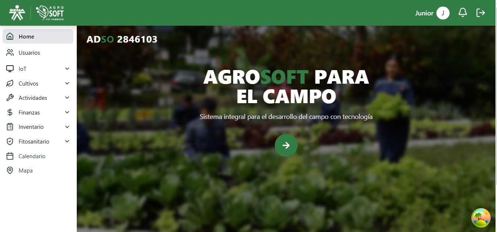

**La página de inicio de AgroSoft TIC-Yamboró es el punto central de acceso a la información y funciones del sistema. Desde esta pantalla, el usuario puede visualizar datos ambientales, gestionar actividades y navegar a diferentes secciones.**

## Pagina Principal  
  

## **Elementos de la Página**

### **1. Barra de Navegación (Superior)**
- **Buscador**: Permite realizar búsquedas dentro del sistema.
- **Cerrar sesión**: Opción para salir de la plataforma.
- **Usuario Estándar**: Indica el tipo de usuario actual.
- **Notificaciones**: Icono de campana para acceder a recordatorios y alertas.

### **2. Menú Lateral (Izquierda)**
El menú lateral permite acceder a diferentes módulos:
- **Home**: Página principal del sistema.
- **Usuarios**: Gestión de usuarios registrados en el sistema.
- **IoT**: Información de sensores y dispositivos IoT.
- **Calendario**: Programación de actividades y eventos.
- **Mapa**: Representación visual de los cultivos y sensores en el área de producción.
- **Cultivos**: Registro y control de los cultivos en producción.
- **Finanzas**: Información sobre costos, ingresos y administración financiera.

### **3. Sección de Productos**
- Muestra un producto agrícola destacado con su imagen, nombre y precio.
- Contiene botones de navegación para visualizar diferentes productos.

### **4. Información Climática**
- **Temperatura**: Muestra la temperatura actual en grados Celsius.
- **Humedad**: Indica el porcentaje de humedad ambiental.

### **5. Actividades y Recordatorios**
- **Actividades**: Acceso rápido a la gestión de tareas y actividades pendientes.
- **Recordatorios**: Sección para configurar alertas y eventos importantes.

### **6. Mapa Interactivo**
- Representación gráfica del área de producción con ubicaciones de sensores y puntos de interés.

### **7. Calendario**
- Muestra el mes actual con fechas resaltadas para eventos o actividades programadas.

## **Funcionamiento General**
- El usuario puede interactuar con los diferentes módulos a través del menú lateral.
- Se pueden visualizar datos en tiempo real sobre temperatura y humedad.
- Es posible gestionar actividades y recordatorios desde la pantalla de inicio.
- El sistema permite la navegación rápida entre productos y cultivos.
