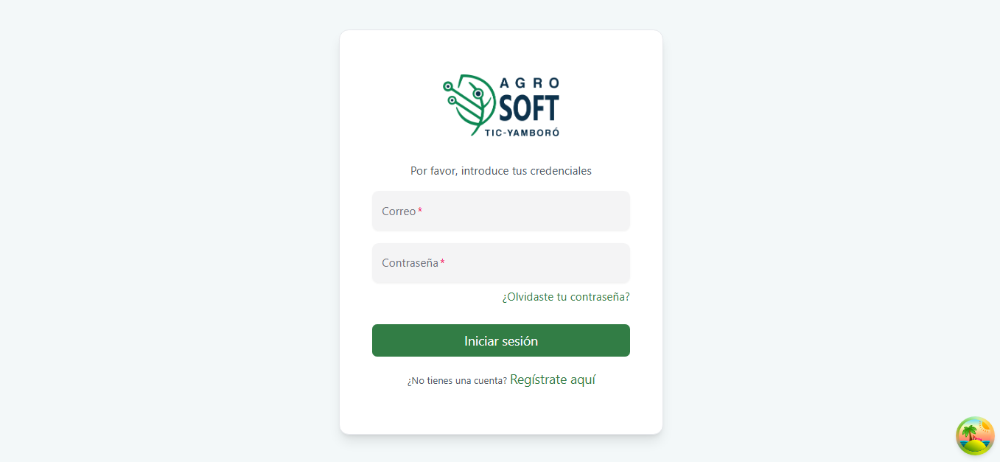

  <h3> ¿Listo para comenzar?</h3>
  <p>Sigue esta ruta recomendada para nuevos usuarios:</p>
  <ol>
    <li>Accede a la ruta de la web agrosoft</li>
    <li>Registrate</li>
    <li>Inicia sesion</li>
  </ol>


---

### Pasos detallados:  

1. **Acceso a la plataforma**  
   Abre tu navegador web (Chrome, Firefox o Edge) e ingresa a:  
   ```  
   https://ejemplo.agrosoft.com  
   ```  
   *Nota: Recomendamos usar versiones actualizadas de los navegadores.*  

---

### Pantalla de Inicio de Sesión
  
2. **Opciones disponibles**  
   - Botón `Ingresar`: Verifica tus credenciales y accede al sistema.  
   - Enlace `¿Olvidaste tu contraseña?`: Te guiará paso a paso para restablecer tu acceso.  
   - Enlace `¿Nuevo? registrate aqui`: Como usuario nuevo esta es tu primer opcion. haz click sobre ella.
   ### Pantalla de Registro de nuevo usuario  
 
   - Enlace `¿Nuevo? registrate aqui`: Rellena los campos del formulario con los datos solicitdados.
   - ingresa una contraseña alfanumerica es decir que contenga numeros y letras para mayor seguridad.
   Nota: recuerda tu contraseña, es necesaria para acceder al sistema.

:::note
   Listo ya estas registrado automaticamente seras enviado de nuevo a la <a href="#pantalla-de-inicio-de-sesión">→ pantalla de inicio de sesion</a>.
:::


3. **Datos de autenticación**  
   - **Campo "Correo Electronico":**  
     Introduce el correo electrónico registrado.  
     *Ejemplo: usuario@dominio.com*  
   - **Campo "Contraseña":**  
     Ingresa tu contraseña (distingue entre mayúsculas y minúsculas).  

---

## ⚠️ Solución de Problemas Frecuentes  

### Error: "Credenciales incorrectas"  
1. Verifica que el **bloqueo de mayúsculas** no esté activado.  
2. Asegúrate de no incluir espacios antes o después de tu usuario/contraseña.  
3. Si el problema persiste, contacta al equipo de soporte técnico.  

---

