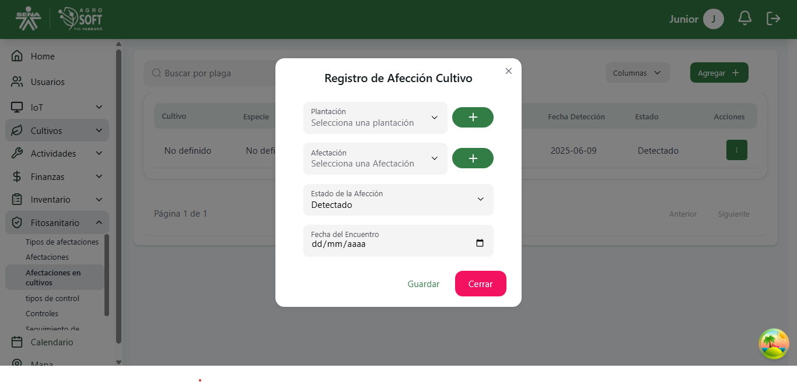
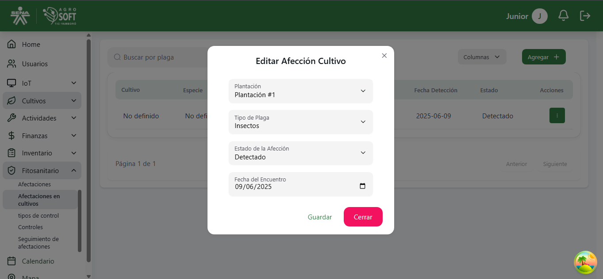

##  Uso de Afecciones en el Cultivo

El módulo **Afecciones en el Cultivo** permite gestionar el registro y control de afecciones en las plantaciones. Antes de registrar una afección, **debe existir al menos una plaga registrada en el sistema**.

### 1️ **Acceder a la sección de Afecciones en el Cultivo**
Para gestionar las afecciones en el cultivo, sigue estos pasos:
1. Inicia sesión en el sistema.
2. En el menú de navegación, selecciona **Gestión Fitosanitaria**.
3. Dentro de esta sección, haz clic en **Afecciones en el Cultivo**.

## Página de Afecciones en el Cultivo/

### 2️ **Registrar una nueva Afección en el Cultivo**
Para agregar una nueva afección en el cultivo:
1. Asegúrate de que **existe al menos una plaga registrada** en el sistema.
2. Dentro de la pantalla de **Afecciones en el Cultivo**, haz clic en el botón **"Agregar"**.
3. Completa los siguientes campos:

## Agregar Afección en el Cultivo

   - **Plantación:** Selecciona la plantación afectada.
   - **Plaga:** Selecciona la plaga identificada.
   - **Fecha de Detección:** Indica la fecha en la que se encontró la afección.
   - **Estado:** Especifica el estado de la afección (**ST**, **EC**, **EL**).

4. Haz clic en **"Guardar"** para registrar la afección.

### 3️ **Consultar y editar afecciones existentes**
- Para ver la información de una afección en el cultivo, usa la lista disponible en la sección de:

## Lista de Afecciones en el Cultivo

- Para **editar** una afección en el cultivo, haz clic en los tres puntos debajo de acciones, modifica los datos necesarios y haz clic en "Guardar".

## Ventana Editar Afección en el Cultivo

