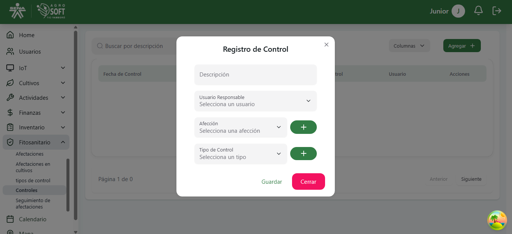

##  Uso de Controles

El módulo **Controles** permite gestionar el registro y aplicación de controles sobre afecciones en los cultivos. Antes de registrar un control, **debe existir al menos una afección y un tipo de control registrada en el sistema**.

### 1 **Acceder a la sección de Controles**
Para gestionar los controles, sigue estos pasos:
1. Inicia sesión en el sistema.
2. En el menú de navegación, selecciona **Gestión Fitosanitaria**.
3. Dentro de esta sección, haz clic en **Controles**.

## Página de Controles

### 2 **Registrar un nuevo Control**
Para agregar un nuevo control:
1. Asegúrate de que **existe al menos una afección y un tipo de control registrado** en el sistema.
2. Dentro de la pantalla de **Controles**, haz clic en el botón **"Agregar"**.
3. Completa los siguientes campos:

## Agregar Control

   - **Afección:** Selecciona la afección a la que se aplicará el control.
   - **Tipo de Control:** Especifica el tipo de control aplicado (biológico, químico, mecánico, etc.).
   - **Descripción:** Agrega una breve descripción del control aplicado.
   - **Fecha de Aplicación:** Indica la fecha en que se aplicó el control.
4. Haz clic en **"Guardar"** para registrar el control.

### 3 **Consultar y editar controles existentes**
- Para ver la información de un control, usa la lista disponible en la sección.

## Lista de Controles

- Para **editar** un control, haz clic en los tres puntos debajo de acciones, modifica los datos necesarios y haz clic en "Guardar".

## Ventana Editar Control

