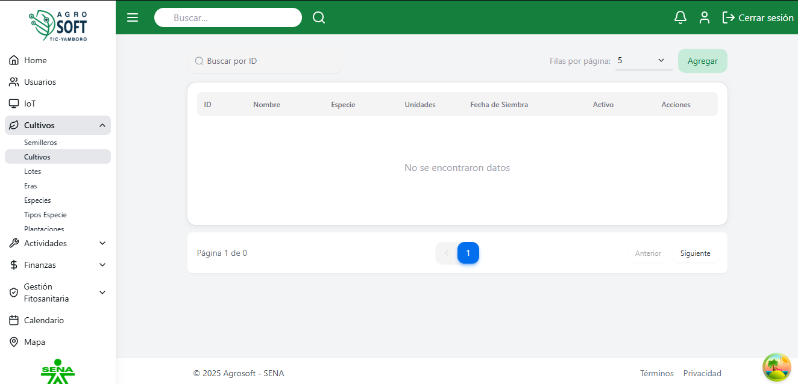
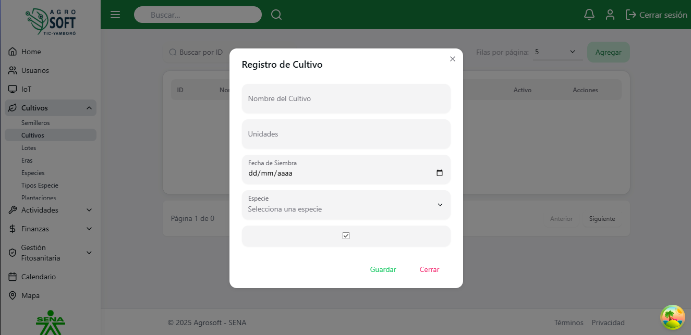
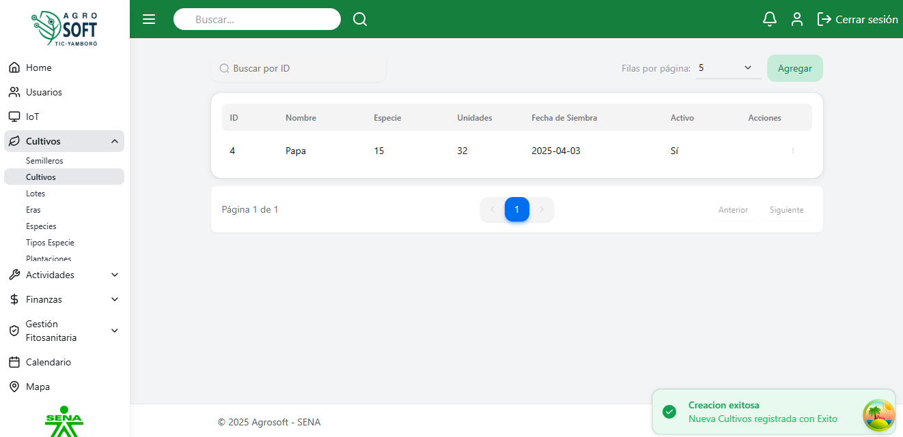
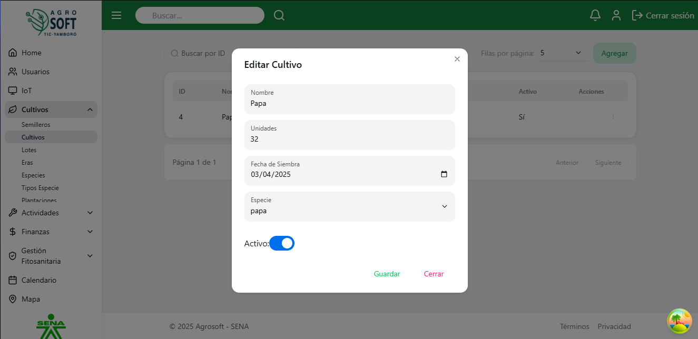
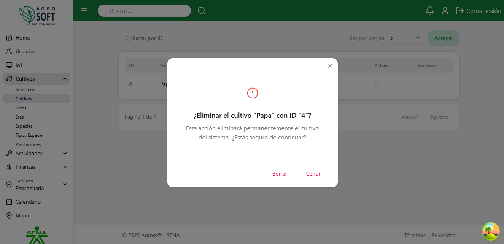

## 🌾 Uso de Cultivos

El módulo **Cultivos** permite gestionar la producción agrícola dentro del sistema, facilitando el control de los cultivos desde su siembra hasta la cosecha. Antes de crear un cultivo, **debe existir al menos una especie registrada en el sistema**.

### 1️⃣ **Acceder a la sección de Cultivos**
Para gestionar los cultivos, sigue estos pasos:
1. Inicia sesión en el sistema.
2. En el menú de navegación, selecciona **Seguimiento de Cultivos**.
3. Dentro de esta sección, haz clic en **Cultivos**.

## Página de cultivos

### 2️⃣ **Registrar un nuevo Cultivo**
Para agregar un nuevo cultivo:
1. Asegúrate de que **existe al menos un semillero registrado** en el sistema.
2. Dentro de la pantalla de **Cultivos**, haz clic en el botón **"Agregar"**.
3. Completa los siguientes campos:
## Agregar cultivo

   - **Nombre:** Escribe un nombre para el cultivo.
   - **Especie:** Selecciona la especie al a que pertenece el cultivo.
   - **Unidades:** Cantidades de cultivo. 
   - **Fecha de siembra:** Fecha en la que se siembra el cultivo.
   - **Estado:** Selecciona el estado del cultivo (activo o inactivo).
4. Haz clic en **"Guardar"** para registrar el cultivo.

### 3️⃣ **Consultar, editar y eliminar cultivos existentes**
- Para ver la información de un cultivo, usa la lista disponible en la sección.
## Lista de cultivos

- Para **editar** un cultivo, haz clic en los tres puntos debajo de **Acciones**, selecciona **Editar**, modifica los datos necesarios y haz clic en **Guardar**.
## Ventana editar

- Para **eliminar** un cultivo, haz clic en los tres puntos debajo de **Acciones**, selecciona **Eliminar** y confirma la acción. 
   - Si no deseas eliminar el cultivo, haz clic en **Cerrar**.
## Ventana eliminar

