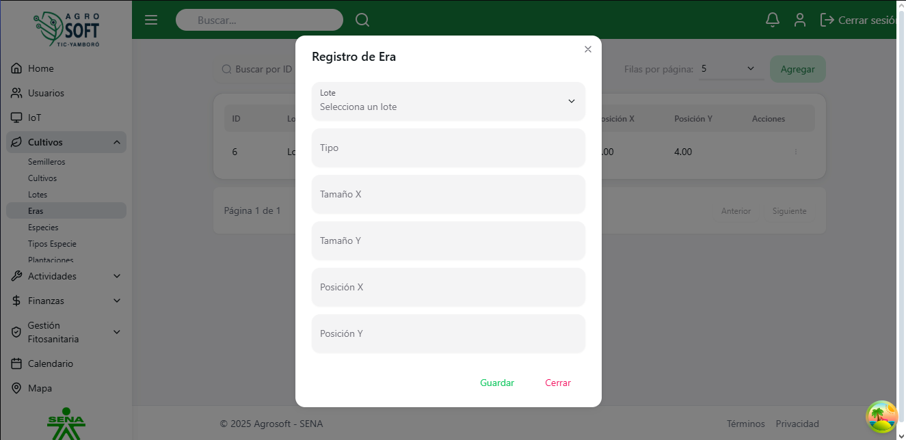

## Uso de Eras

El módulo **Eras** permite registrar y administrar áreas específicas de cultivo dentro del sistema, facilitando su control y planificación. **debe existir al menos un lote registrado en el sistema**.

### **Acceder a la sección de Eras**
Para gestionar las eras, sigue estos pasos:
1. Inicia sesión en el sistema.
2. En el menú de navegación, selecciona **Seguimiento de Cultivos**.
3. Dentro de esta sección, haz clic en **Eras**.

## Página de eras

### **Registrar una nueva Era**
Para agregar una nueva era:
1. Dentro de la pantalla de **Eras**, haz clic en el botón **"Agregar"**.
2. Completa los siguientes campos:
## Agregar era

   - **Lote:** Selecciona el lote al que pertenece la era.
   - **Tipo:** Especifica el tipo de era según su uso.
   - **Tamaño X:** Indica la dimensión horizontal del área.
   - **Tamaño Y:** Indica la dimensión vertical del área.
   - **Posición X:** Ubicación en el eje X dentro del lote.
   - **Posición Y:** Ubicación en el eje Y dentro del lote.
3. Haz clic en **"Guardar"** para registrar la era.

### **Consultar, editar y eliminar eras existentes**
- Para ver la información de una era, usa la lista disponible en la sección.
## Lista de eras

- Para **editar** una era, haz clic en los tres puntos debajo de **Acciones**, selecciona **Editar**, modifica los datos necesarios y haz clic en **Guardar**.
## Ventana editar

- Para **eliminar** una era, haz clic en los tres puntos debajo de **Acciones**, selecciona **Eliminar** y confirma la acción. 
   - Si no deseas eliminar la era, haz clic en **Cerrar**.
## Ventana eliminar

