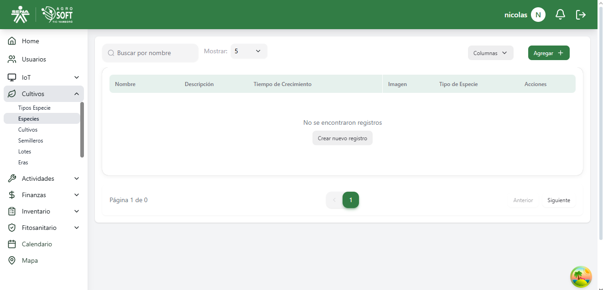
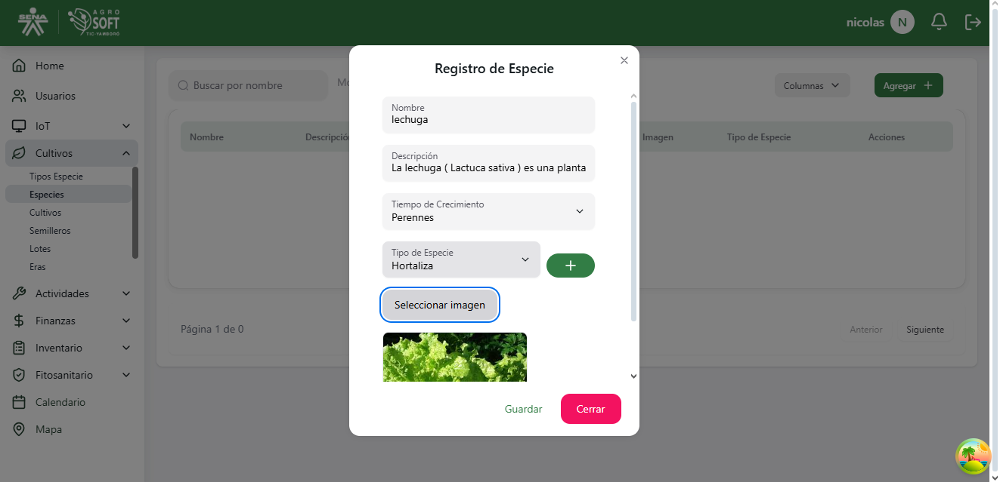
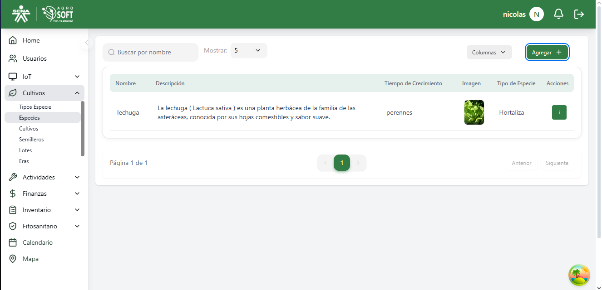
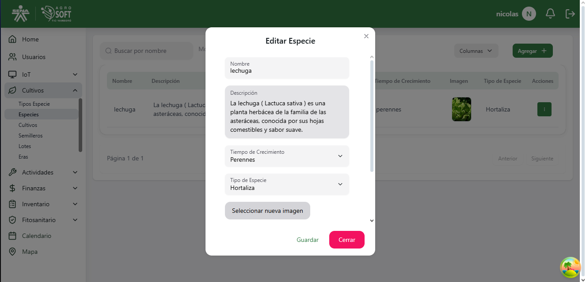

## Uso de Especies

El módulo **Especies** permite registrar y administrar las diferentes especies cultivadas en el sistema, facilitando su identificación y gestión. **debe existir al menos un tipo especie registrado en el sistema**.

### **Acceder a la sección de Especies**
Para gestionar las especies, sigue estos pasos:
1. Inicia sesión en el sistema.
2. En el menú de navegación, selecciona **Seguimiento de Cultivos**.
3. Dentro de esta sección, haz clic en **Especies**.

## Página de especies

### **Registrar una nueva Especie**
Para agregar una nueva especie:
1. Dentro de la pantalla de **Especies**, haz clic en el botón **"Agregar"**.
2. Completa los siguientes campos:
## Agregar especie

   - **Nombre:** Asigna un nombre a la especie.
   - **Descripción:** Proporciona una breve descripción sobre la especie.
   - **Tiempo de Crecimiento (días):** Indica el número de días que tarda la especie en crecer.
   - **Tipo de Especie:** Selecciona el tipo de especie al que pertenece.
3. Haz clic en **"Guardar"** para registrar la especie.

### **Consultar y editar especies existentes**
- Para ver la información de una especie, usa la lista disponible en la sección.
## Lista de especies

- Para **editar** una especie, haz clic en los tres puntos debajo de **Acciones**, selecciona **Editar**, modifica los datos necesarios y haz clic en **Guardar**.
## Ventana editar

