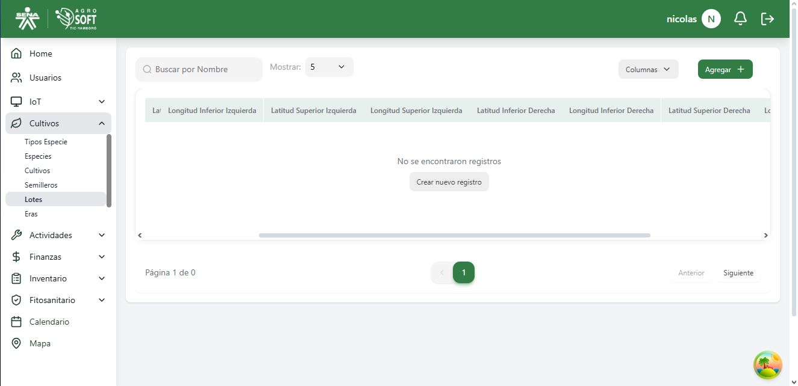
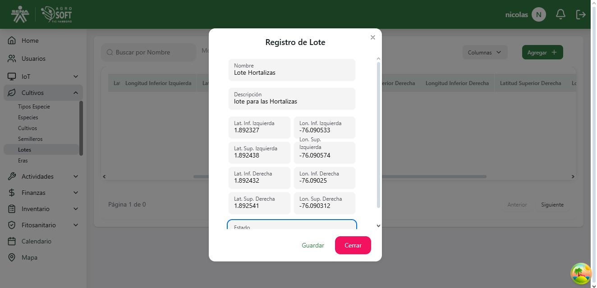
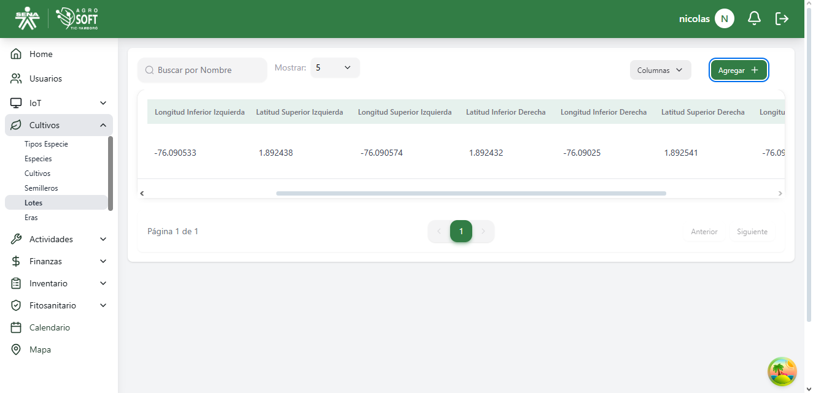
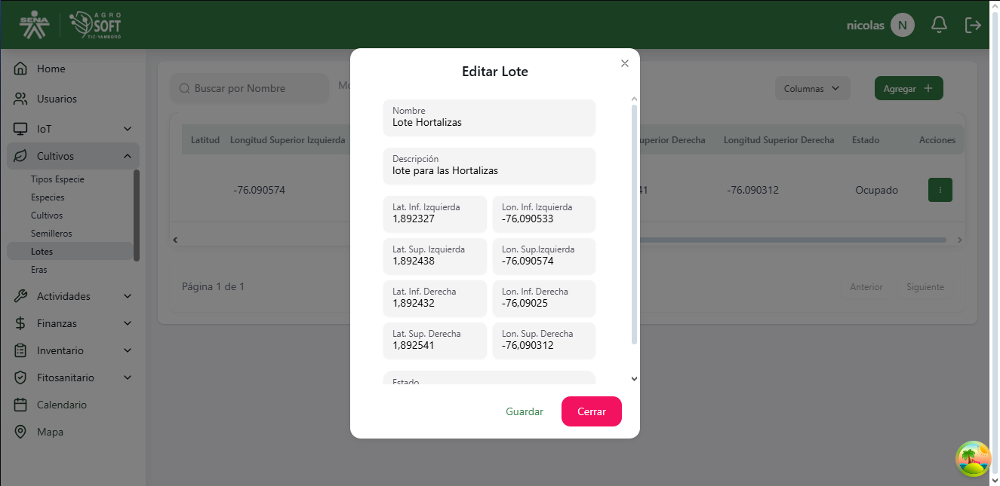
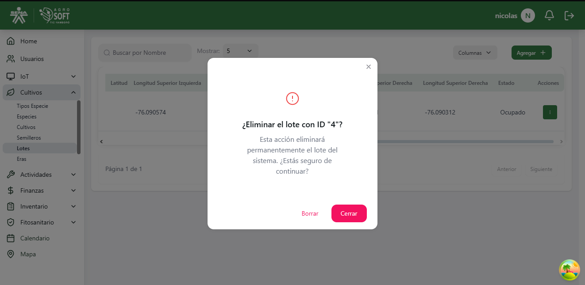

## Uso de Lotes

El módulo **Lotes** permite organizar y gestionar los terrenos donde se cultivan las especies, facilitando el control y la distribución de los cultivos dentro del sistema.

### **Acceder a la sección de Lotes**
Para gestionar los lotes, sigue estos pasos:
1. Inicia sesión en el sistema.
2. En el menú de navegación, selecciona **Seguimiento de Cultivos**.
3. Dentro de esta sección, haz clic en **Lotes**.

## Página de lotes

### **Registrar un nuevo Lote**
Para agregar un nuevo lote:
1. Dentro de la pantalla de **Lotes**, haz clic en el botón **"Agregar"**.
2. Completa los siguientes campos:
## Agregar lote

   - **Nombre:** Asigna un nombre representativo al lote.
   - **Descripción:** Proporciona una breve descripción sobre el lote y su uso.
   - **Tamaño X:** Define la dimensión horizontal del lote.
   - **Tamaño Y:** Define la dimensión vertical del lote.
   - **Estado:** Indica si el lote está disponible u ocupado.
   - **Posición X:** Establece la coordenada X dentro del área de cultivo.
   - **Posición Y:** Establece la coordenada Y dentro del área de cultivo.
3. Haz clic en **"Guardar"** para registrar el lote.

### **Consultar, editar y eliminar lotes existentes**
- Para ver la información de un lote, usa la lista disponible en la sección.
## Lista de lotes

- Para **editar** un lote, haz clic en los tres puntos debajo de **Acciones**, selecciona **Editar**, modifica los datos necesarios y haz clic en **Guardar**.
## Ventana editar

- Para **eliminar** un lote, haz clic en los tres puntos debajo de **Acciones**, selecciona **Eliminar** y confirma la acción. 
   - Si no deseas eliminar el lote, haz clic en **Cerrar**.
## Ventana eliminar
