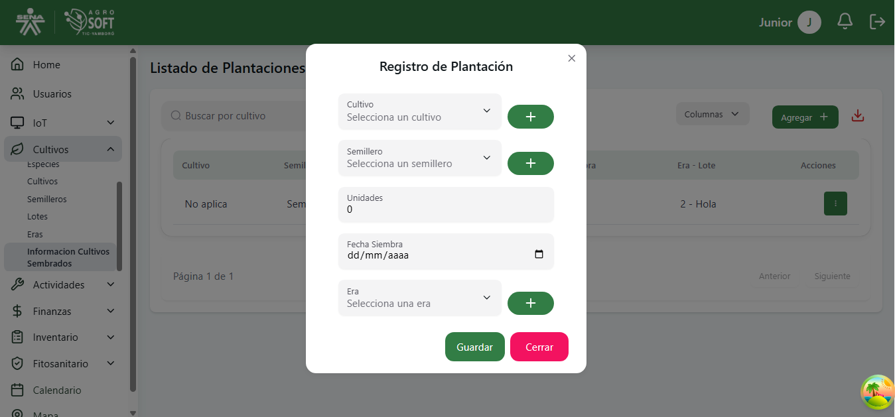

## Uso de Plantaciones

El módulo **Plantaciones** permite registrar y administrar las plantaciones dentro del sistema, facilitando su control y seguimiento. **debe existir al menos una era y un cultivo registrados en el sistema**.

### **Acceder a la sección de Plantaciones**
Para gestionar las plantaciones, sigue estos pasos:
1. Inicia sesión en el sistema.
2. En el menú de navegación, selecciona **Seguimiento de Cultivos**.
3. Dentro de esta sección, haz clic en **Plantaciones**.

## Página de plantaciones

### **Registrar una nueva Plantación**
Para agregar una nueva plantación:
1. Dentro de la pantalla de **Plantaciones**, haz clic en el botón **"Agregar"**.
2. Completa los siguientes campos:
## Agregar plantación

   - **Cultivo:** Selecciona el cultivo asociado a la plantación.
   - **Era:** Especifica en qué era se encuentra la plantación.
3. Haz clic en **"Guardar"** para registrar la plantación.

### **Consultar y editar plantaciones existentes**
- Para ver la información de una plantación, usa la lista disponible en la sección.
## Lista de plantaciones

- Para **editar** una plantación, haz clic en los tres puntos debajo de **Acciones**, selecciona **Editar**, modifica los datos necesarios y haz clic en **Guardar**.
## Ventana editar

