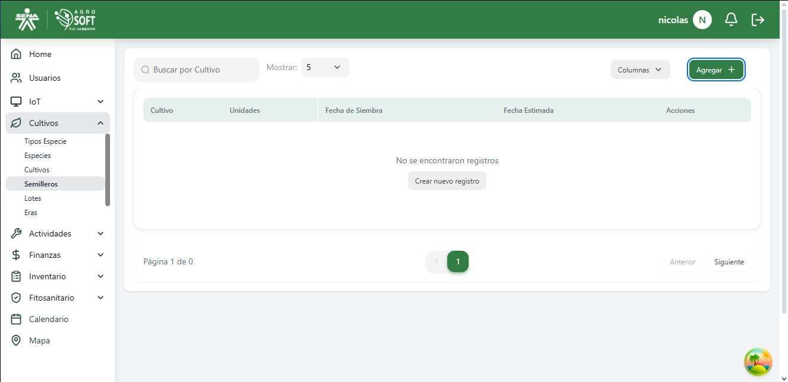
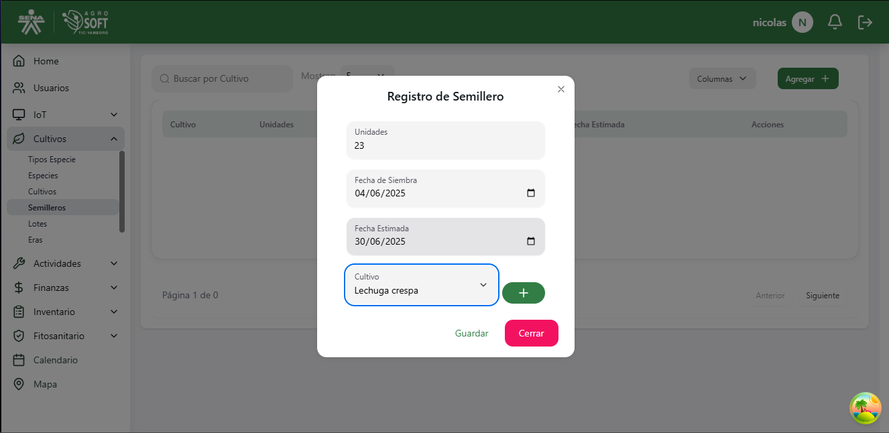
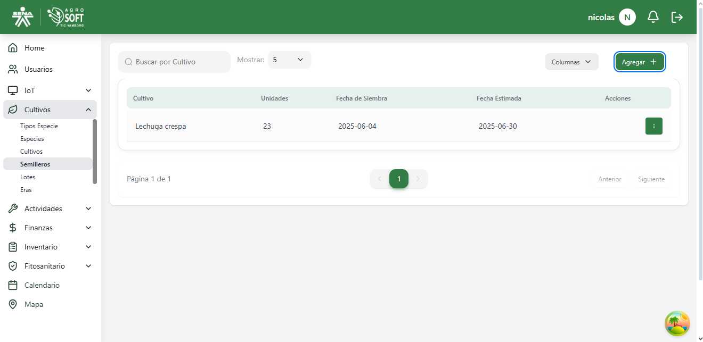
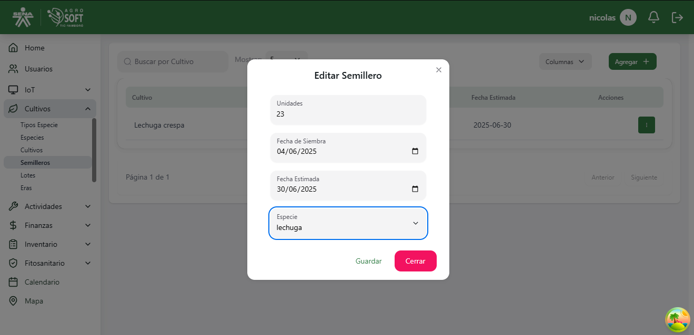

## Uso de Semilleros

El módulo **Semilleros** permite gestionar la siembra y el crecimiento de plantas antes de su trasplante a cultivos definitivos. Antes de crear un semillero, **debe existir al menos una especie registrada en el sistema**.

### **Acceder a la sección de Semilleros**
Para gestionar los semilleros, sigue estos pasos:
1. Inicia sesión en el sistema.
2. En el menú de navegación, selecciona **Cultivos**.
3. Dentro de esta sección, haz clic en **Semilleros**.

## Pagina semilleros

### **Registrar un nuevo Semillero**
Para agregar un nuevo semillero:
1. Asegúrate de que **existe al menos una especie registrada** en el sistema.
2. Dentro de la pantalla de **Semilleros**, haz clic en el botón **"Agregar"**.
3. Completa los siguientes campos:
## Agregar semillero

   - **Nombre:** Escribe un nombre para el semillero.
   - **Ubicación:** Especifica la localización del semillero.
   - **Fecha de siembra:** Selecciona la fecha en la que se sembraron las semillas.
   - **Cantidad de plantas:** Indica cuántas plantas están en el semillero.
   - **Especie:** Selecciona la especie a la que pertenecen las semillas.
4. Haz clic en **"Guardar"** para registrar el semillero.

### **Consultar y editar semilleros existentes**
- Para ver la información de un semillero, usa la lista disponible en la sección.
## lista de semilleros

- Para **editar** un semillero, haz clic en los tres puntos debajo de acciones, modifica los datos necesarios y haz click en "guardar".
## ventana editar

