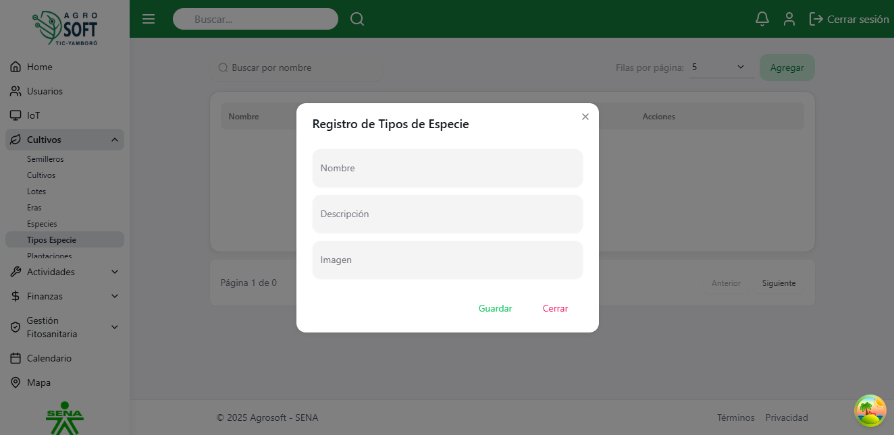
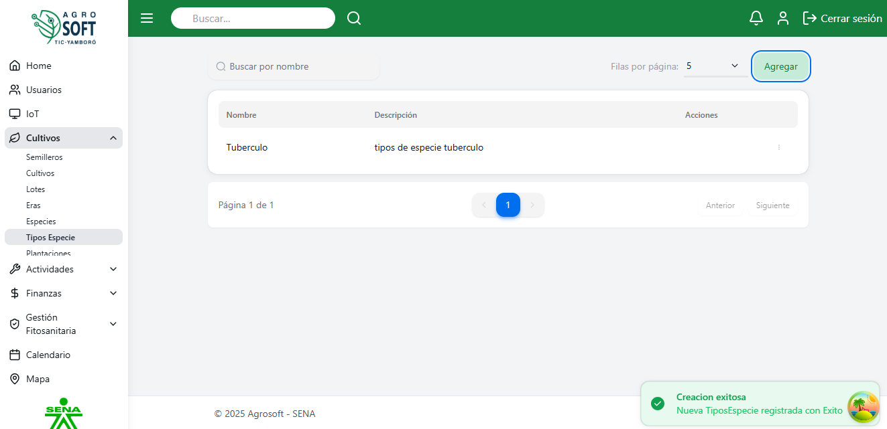
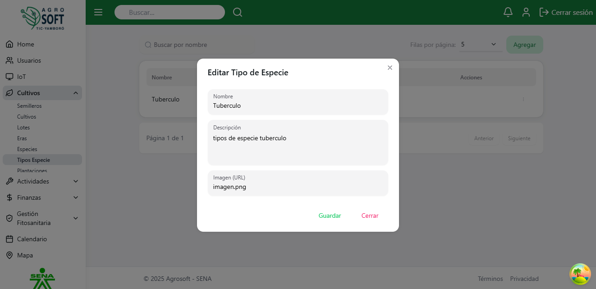
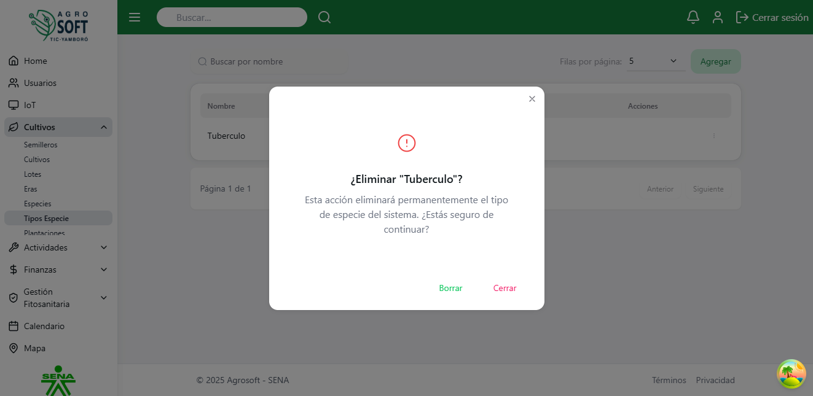

## 🔬 Uso de Tipos de Especie

El módulo **Tipos de Especie** permite clasificar las especies en diferentes variedades dentro del sistema. Antes de crear un tipo de especie.

### 1️⃣ **Acceder a la sección de Tipos de Especie**
Para gestionar los tipos de especie, sigue estos pasos:
1. Inicia sesión en el sistema.
2. En el menú de navegación, selecciona **Seguimiento de Cultivos**.
3. Dentro de esta sección, haz clic en **Tipos de Especie**.

## Página de tipos de especie

### 2️⃣ **Registrar un nuevo Tipo de Especie**
Para agregar un nuevo tipo de especie:
1. Asegúrate de que **existe al menos una especie registrada** en el sistema.
2. Dentro de la pantalla de **Tipos de Especie**, haz clic en el botón **"Agregar"**.
3. Completa los siguientes campos:
## Agregar tipo de especie

   - **Nombre:** Escribe un nombre para el tipo de especie.
   - **Descripción:** (Opcional) Agrega información relevante sobre el tipo de especie.
4. Haz clic en **"Guardar"** para registrar el tipo de especie.

### 3️⃣ **Consultar, editar y eliminar tipos de especie existentes**
- Para ver la información de un tipo de especie, usa la lista disponible en la sección.
## Lista de tipos de especie

- Para **editar** un tipo de especie, haz clic en los tres puntos debajo de **Acciones**, selecciona **Editar**, modifica los datos necesarios y haz clic en **Guardar**.
## Ventana editar

- Para **eliminar** un tipo de especie, haz clic en los tres puntos debajo de **Acciones**, selecciona **Eliminar** y confirma la acción. 
   - Si no deseas eliminar el tipo de especie, haz clic en **Cerrar**.
## Ventana eliminar

