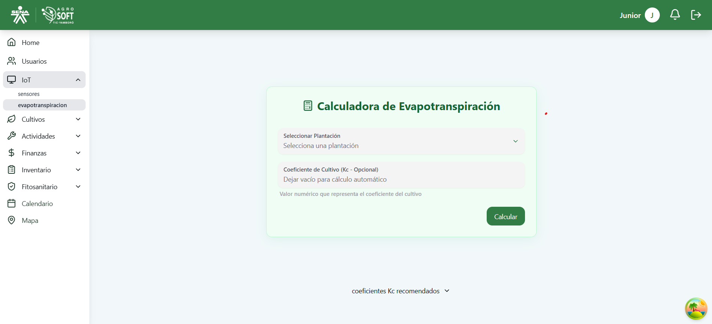
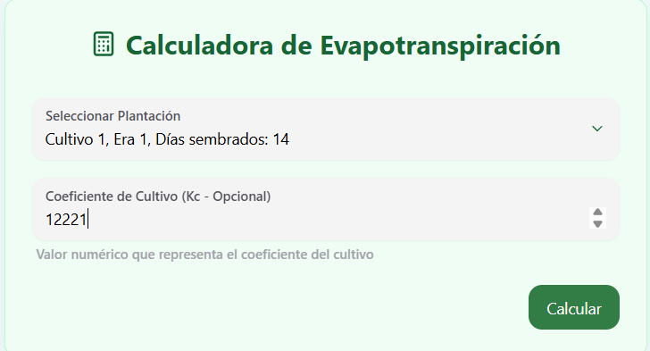
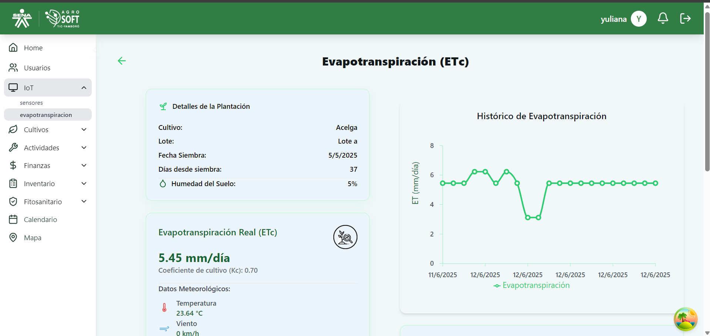
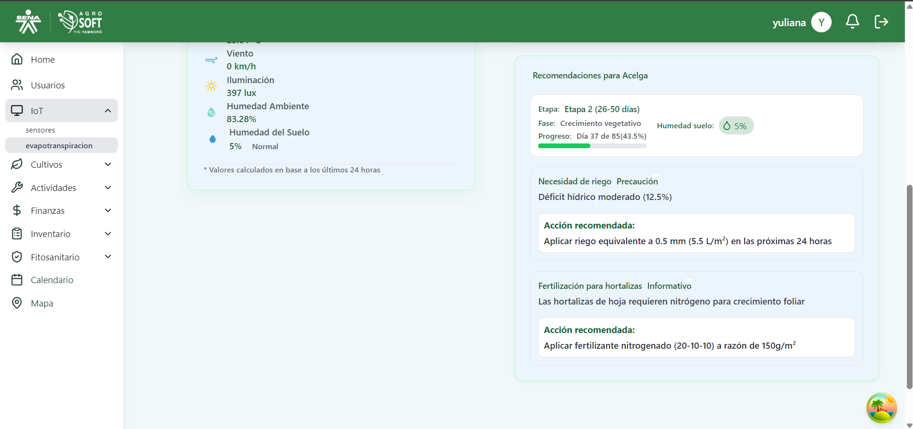

El módulo de Evapotranspiración permite visualizar valores calculados a partir de datos captados por sensores IoT. Es útil para estimar las necesidades hídricas del cultivo.

## Vista General
 

Se muestra la tarjeta con los siguientes datos:

- **Seleccionar plantación**  

- **Coeficiiente del cultivo:**
Valor numérico que representa el coeficiente del cultivo.

## Cálculo Manual
 

Botones disponibles: **Calcular**

## Tabla de Cálculos
Muestra registros con:

- **Fecha**
- **ET (mm/día)**
- **Ubicación**
- **Método**

## Detalles de Registro
 
 

Incluye gráfica de últimos días y tabla de variables utilizadas para el cálculo.

