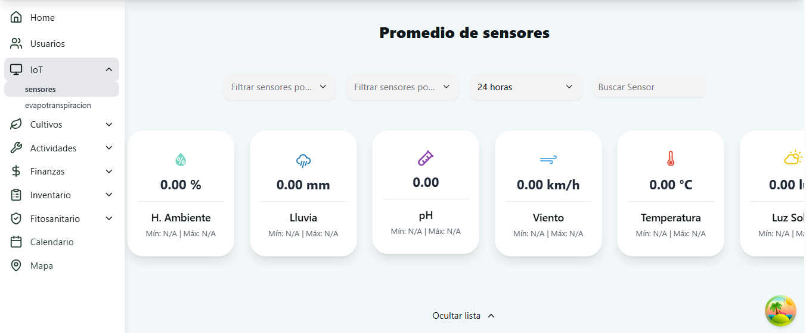
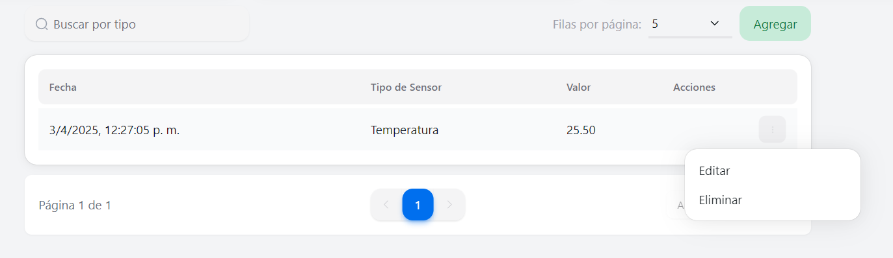
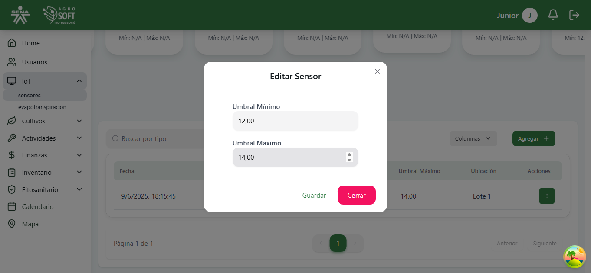
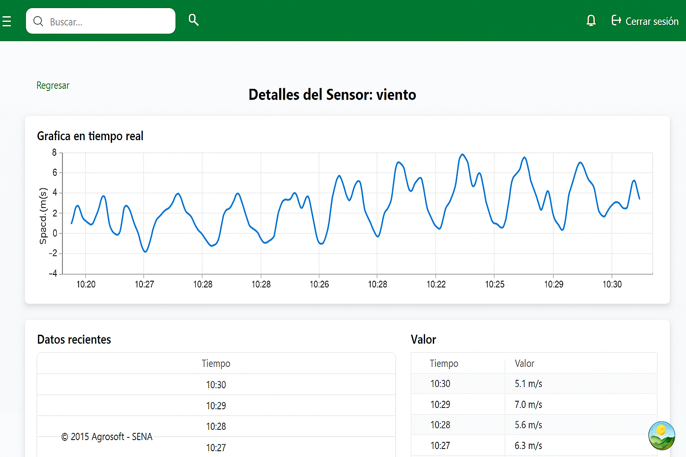

El Panel de Monitoreo permite visualizar en tiempo real los datos recopilados por los sensores IoT instalados en el campo. Aquí, los usuarios pueden acceder a información clave sobre las condiciones ambientales

## Pagina Principal IoT
  

### Sección "Filtrar Sensores"
Esta opción permite buscar y filtrar sensores específicos según el tipo de medición que realizan.

### Panel de Sensores IoT
Una vez ya haya ingresado al modulo, se mostrarán diferentes tarjetas con informacion en tiempo real:

1. **Viento** 
    - Este esta representando la velocidad del viento en km/h
    - Útil para monitorear condiciones meteorológicas y planificar actividades al aire libre.

2. **Temperatura**
    - Muestra la temperatura actual en grados Celsius (°C).
    - Ayuda a tomar decisiones sobre riego y protección de cultivos.

3. **Luz Solar**
    - Indica el estado del clima (soleado, nublado, etc.).
    - Muestra el porcentaje de radiación solar detectado.
    - Permite evaluar la cantidad de luz que reciben los cultivos.

4. **Humedad**
    - Indica el porcentaje de humedad relativa en el ambiente.
    - Factor clave para determinar necesidades de riego.

5. **Humedad Ambiental**
    - Muestra el porcentaje de humedad en el aire.
    - Útil para prever condiciones climáticas y evitar enfermedades en cultivos.

6. **Lluvia**
    - Indica si hay presencia de lluvia en la zona monitoreada.
    - Permite ajustar el riego de acuerdo con las condiciones climáticas.

### Sección de Configuración y Control
Debajo del panel de sensores, se encuentran herramientas para la administración de los datos:

- **Buscra por tipo de sensor**:
Permite filtrar los registros según el tipo de sensor.

- **Selector de filas por página**: 
Define cuántos registros de sensores se muestran por página.

- **Botón "Agregar"**:
Permite añadir nuevos sensores al sistema.

    - **Tabla Listrar sensores**
      Debajo de la Sección de Configuración y Control se encuentra una tabla qeu lista los sensores registrados, donde muestra:
        - **Fecha** : Fecha del día que se hizo el registro del sensor
        - **Tipo de sensor** : El tipo de sensor que se registro.
        - **valor** : Registro de la medición captada por el sensor.

### Registrar un sensor
El boron "**Agregar**" que se encuentra en la parte derecha de la tabla registros de sensores. su funcion es perimitir al usuario ingresar manualmente nuevos sensores al sistema con los siguientes datos:

- **Valor del Sensor**: Registro de la medición captada por el sensor.
- **ID del Lote**: Identificación del lote donde está instalado el sensor.
- **ID de las Eras**: Código correspondiente a la era dentro del lote.
- **Fecha del Registro**: Día, mes y año en que se tomó la medición.
- **Tipo de Sensor**: Clasificación del sensor (Ej: Temperatura, Humedad, Viento, etc.).
    
    - #### Cómo Usarlo
        1. Presionar el botón "**Agregar**".
        2. Ingresar la información correspondiente en cada campo.
        3. Ingresar la información correspondiente en cada campo.
        4. Presionar el botón "**Guardar**" para almacenar el nuevo sensor.
        5. En caso de no querer guardar los cambios, presionar "Cerrar" para salir sin realizar modificaciones.

### Menú de Acciones en la Tabla de Sensores

En la tabla de sensores, el usuario puede ver una lista de registros. Al hacer clic en el icono de opciones (⋮) en la columna "Acciones", se despliega un menú con la opción de editar:

- **Editar**: Permite modificar los datos del sensor seleccionado.

#### Editar un Sensor

 Al seleccionar la opción "Editar", se abrirá un formulario emergente donde el usuario puede modificar la información del sensor. Los campos editables incluyen: 
- **Valor del Sensor** : Permite actualizar el valor registrado.
- **ID del Lote y Eras** : Identificadores del área de cultivo.
- **Fecha del Registro** : Campo de selección de fecha.
- **Tipo de Sensor** : Lista desplegable con los tipos disponibles.
- **Botón "Guardar"** : Guarda los cambios realizados.
- **Botón "Cerrar"** : Cancela la edición y cierra la ventana.

### Detalles del Sensor

 
Esta pantalla se muestra cuando el usuario selecciona una tarjeta de sensor en la vista general de sensores dentro del módulo IoT. En este caso, se han seleccionado los detalles del sensor de viento.

#### Elementos de la pantalla:
1. Botón "**Regresar**".
    - Permite volver a la vista anterior donde se listan los sensores.
2. Título "**Detalles del Sensor: Viento**"
    - Muestra el nombre del sensor seleccionado.
3. Gráfica en tiempo real
    - Representa visualmente los datos capturados por el sensor en tiempo real.
4. Tabla de datos recientes
    - Muestra los últimos cinco registros obtenidos por el sensor, organizados en dos columnas:
        - **Tiempo**: Indica la fecha y hora del registro.
        - **Valor**: Representa la medición capturada en ese instante.

